# Lab 6: Integrating with Azure DevOps

Azure Boards is a powerful tool within the Azure DevOps suite designed to help teams plan, track, and manage their work. Integrating Azure Boards with GitHub can significantly enhance project management by linking development activities with planning and tracking workflows. Here's how this integration can benefit your team and the steps to set it up:

### Benefits of Integrating Azure Boards with GitHub

- **Unified Workflow**: Sync work items and pull requests between Azure Boards and GitHub, ensuring that all team members have visibility into progress and issues, regardless of the platform they use.
- **Automated Linking**: Automatically link GitHub commits and pull requests to work items in Azure Boards. This creates traceability from code changes to project tasks.
- **Enhanced Collaboration**: Teams can use GitHub for source control and collaboration while leveraging Azure Boards for work item tracking, providing a seamless experience across both platforms.
- **Improved Planning and Tracking**: Plan sprints, track progress, and manage backlogs in Azure Boards while developers continue to use GitHub for their code repositories.

In this exercise, you'll explore Azure boards and Azure test plans. Azure Boards provides software development teams with the interactive and customizable tools they need to manage their software projects. Azure Test Plans provide rich and powerful tools everyone in the team can use to drive quality and collaboration throughout the development process. The easy-to-use, browser-based test management solution provides all the capabilities required for planned manual testing.

### Task 1: Connect the Azure Board with GitHub

In this task, you'll connect your Azure DevOps project's board to your GitHub repository using the Azure Boards app for GitHub to support the integration between Azure Boards and GitHub. This app is free for both public and private repositories. You'll also explore work items.  In this task, you'll make changes in GitHub, link a PR to Azure boards using syntax, and monitor the work item.

1. In your browser, open Azure DevOps by navigating to the below URL:

    ``` 
    https://dev.azure.com/  
    ```
1. Choose **Start Free (1)**.

   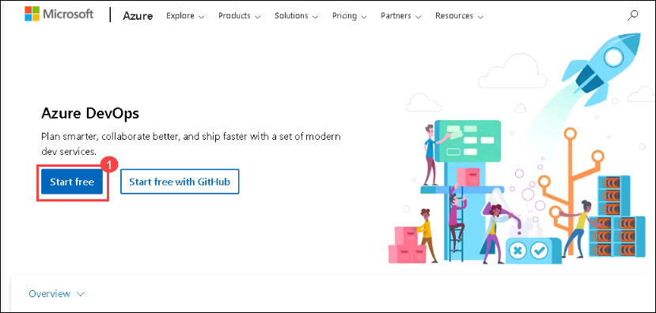

1. Log in using your credentials.

   - **Email/Username**: **<inject key="AzureAdUserEmail"></inject>**

   - **Password**: **<inject key="AzureAdUserPassword"></inject>**

   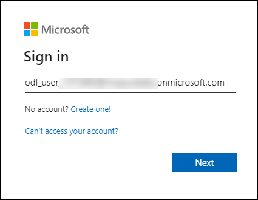

   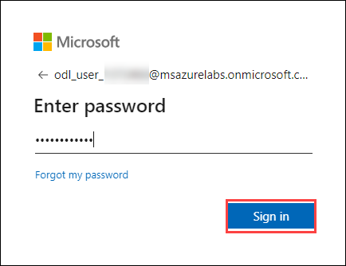

   - In case, if you handle up in Get started with Azure DevOps page, leave options to default and Click on **Continue**.

   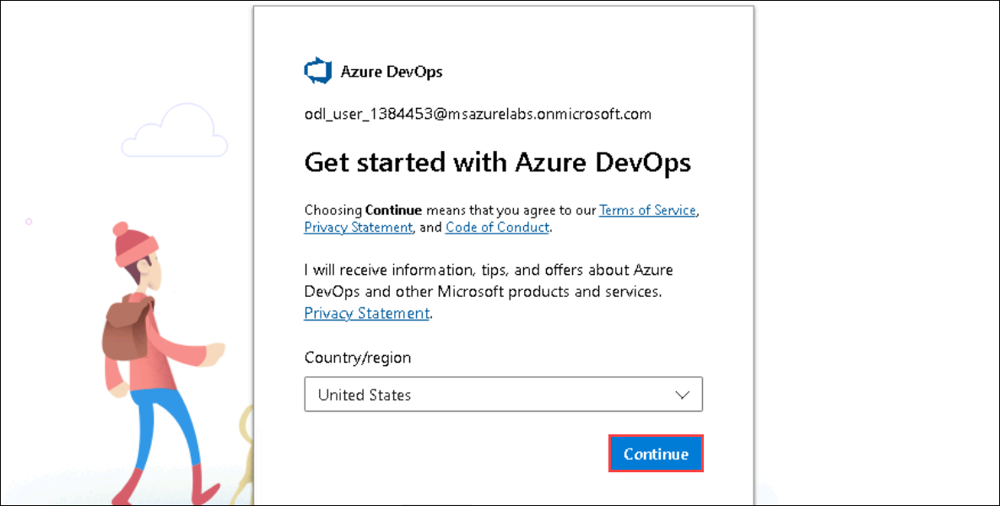

  - After clicking on the **Continue** option in the **Get started with azure DevOps** page, you'll see the **Almost Done** page. Leave options to default and carefully type the Captcha Code provided.

  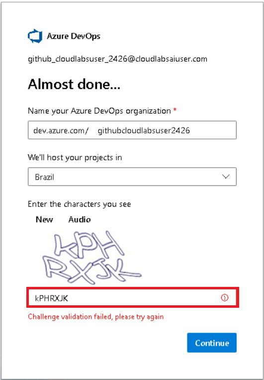
   
1. In the **Create a project to get started** page, enter the **Project name** as **Azure DevOps** **(1)**. Keep visibility to **Public** **(2)** and click on **+ Create project** **(3)**.

   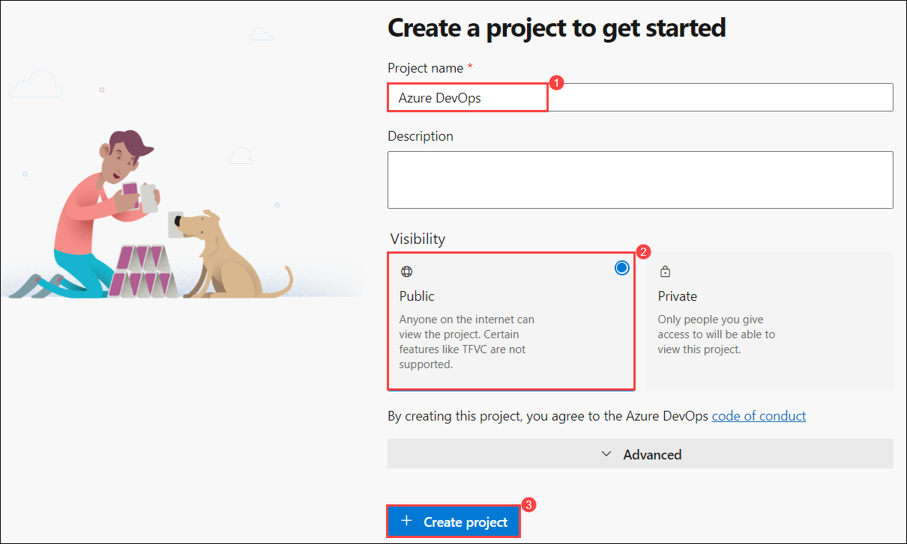

   >**Note**: If you cannot select public visibility, please follow the steps below.

   - Click on **Organization policies (1)**.
  
     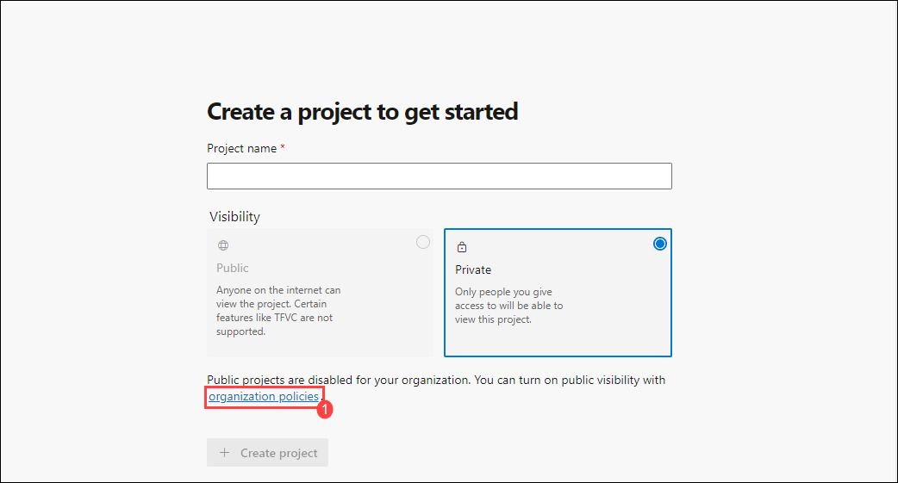

   - In the **Organization Settings** page, go to the **Policies (1)** option under **Security**, enable **Allow public projects (2)**, and click on **Save**. Then, select the public visibility setting.
     
     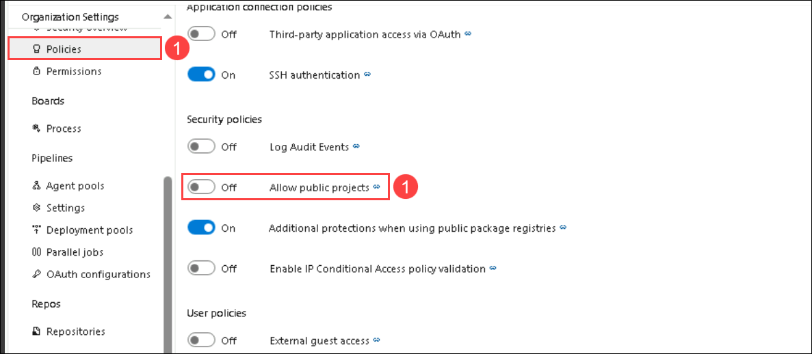

     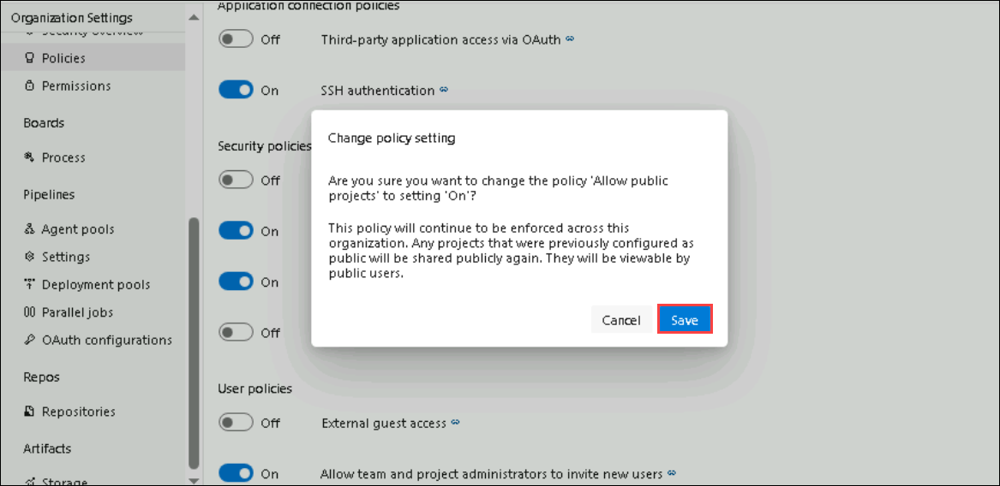

   - Click on the **Azure DevOps** icon to navigate back to the home page. Follow **step 1** again, and now you should be able to select the **Public** option under **Visibility**.

     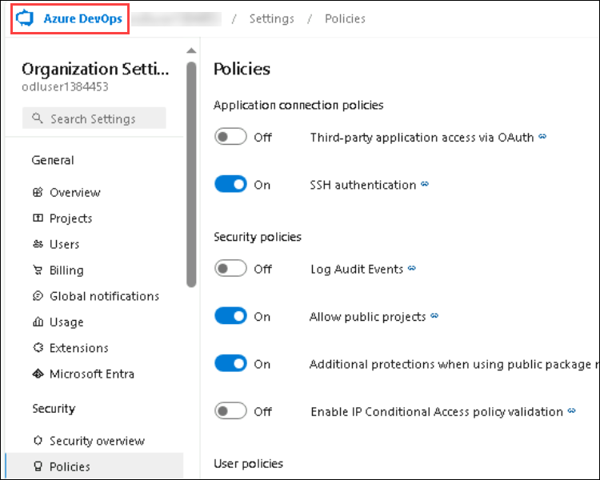
      
1. On the **Azure DevOps page,** click on **User settings** **(1)** from the top right corner of the page and click on **Preview features** **(2)**.

   

    > **Note:** If you get a sign-in error, then click on **Sign out, and sign in with a different account** link, and login with your ODL user's Azure credentials. On the next page, leave the details to default and proceed. You should be logged in to the Azure DevOps organization. 

1. In the **Preview features** pop-up, ensure to set the toggle button to **off** for **New Boards Hubs** **(1)** and close the preview features by clicking on **X** **(2)**.
   
   

1. In your browser, open GitHub Marketplace by navigating to the URL provided below:

    ``` 
    https://github.com/marketplace/azure-boards
    ```

    

1. Scroll to the bottom of the page and select `Install it for Free.`

   

    >**Note:** If the **Install it for free** button is grayed out, please proceed to the next step.

1. Please enter the billing details:

    - `First name`: <inject key="AzureAdUserEmail"></inject>
    - `Last name`: <inject key="DeploymentID"></inject>
    - `Address`: Please provide any placeholder address.
    - `City`: Pick the city you want.
    - `State`: Pick the state you want.
    - `Zip`: Provide the postal code.

    
    
1. On the next page, select **Complete order and begin installation**.

1. Click on the **only select repositories (1)** option, select the lab files repository **(2)**, `github-action` **(3)**, that you created earlier, and click on **Install & Authorize (4)**.

   
    
   > **Note**: If you see the message. **You’ve already purchased this on all of your GitHub accounts** this indicates Azure Boards integration is already used in your account. Follow the steps below.

   - On the **Azure Boards Marketplace** page, click the **ellipsis (1)** in the upper right corner and select the **Username (2)**.

     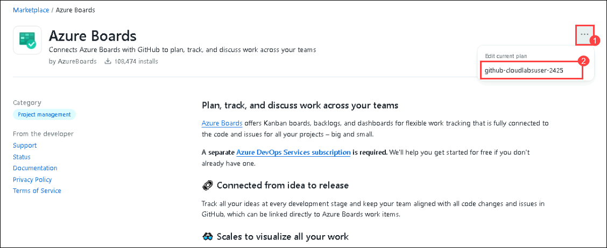
   
   - In the edit your plan window, select **grant this app access**.
   
     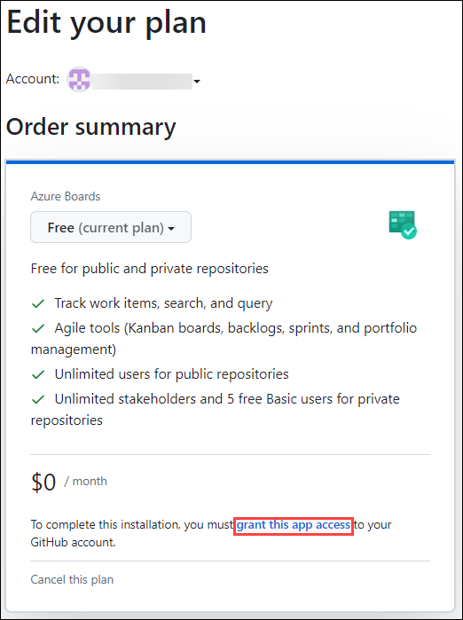
   
   - Click on the **only select repositories (1)** option. Select the lab files repository **(2)** `github-action` **(3)** which you created earlier and click on **Install & Authorize (4)**.

       

    - Select the cloudlabs **Email**. <inject key="AzureAdUserEmail"></inject>
     
    - Now, enter the password and **click** on **Sign in**.

       .
    
1. Select the **Azure DevOps organization (1)** and the **Azure DevOps** **(2)** project, then click on **Continue (3)**.

    

    > **Note**: After successfully logging in to the Azure DevOps portal, you'll get to see the **Success!** pop-up window on your screen. Click on the **close** button to remove it.
1. When the integration succeeds, you'll be taken to the Azure DevOps Board. In the onboarding tutorial, click on **Create** to create an initial issue in the `To Do` column.
    >**Note**: Make sure to reduce the screen resolution in your browser window if you're not able to view the **Create** and **Create and link a pull request** options in the onboarding tutorial page.

   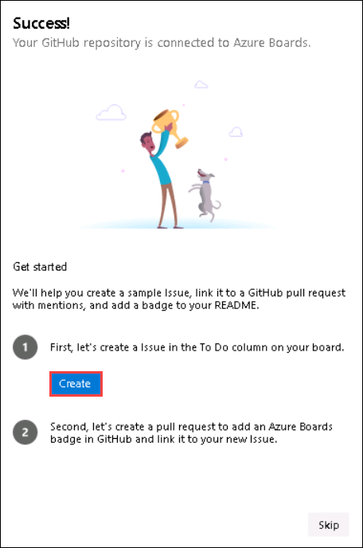
    
1. Now click on **Create and link a pull request** to create a pull request associated with your issue.

   

1. Click on **View work item**.

   
   
1. Open the new issue that the onboarding tutorial creates and observe the GitHub pull request and comments that are linked to the Azure DevOps board issue.

   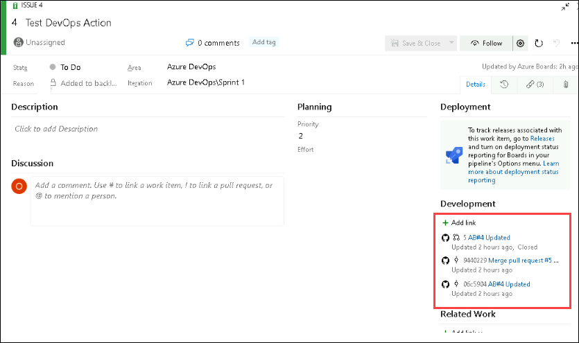

1. In GitHub, browse through the `Pull Requests` tab of the lab files repository created in [Task 1 of the Before the HOL Instructions] and open the pull request that was created in the onboarding tutorial for the Azure Boards Integration App. Note the `AB#1` annotation in the pull request comments - this annotation signals to Azure DevOps that this pull request comment should be linked to Issue #1 in Azure Boards.

   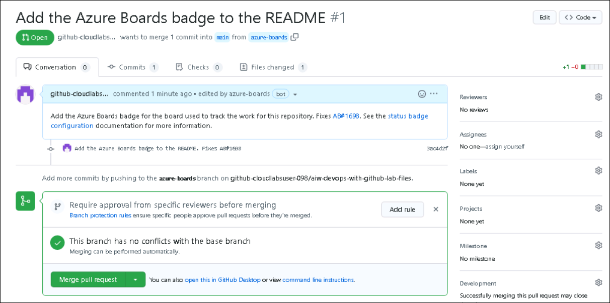

1. Select the `Files changed` tab within the pull request detail and observe the change to the README.md associated with this pull request. After reviewing the changes, go back to the `Conversation` tab, select the `Merge pull request` button, and confirm the following prompt to merge the pull request into the `main` branch.

   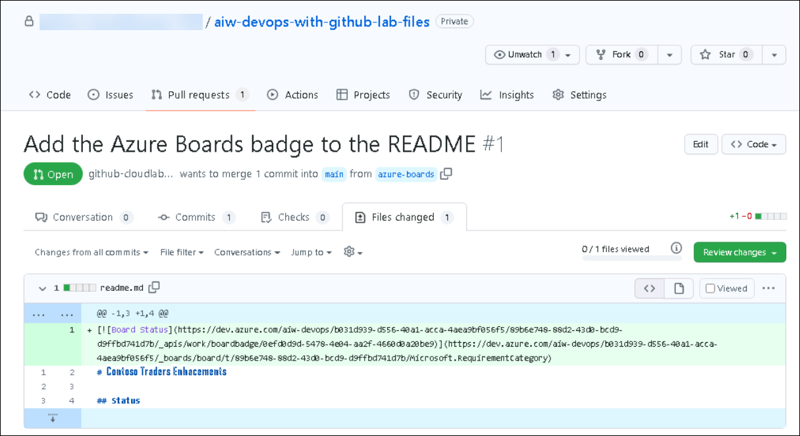

1. In Azure DevOps Boards, find the work item and observe that the issue has been moved to the `Done` column on completion of the pull request.

      

1. You've successfully linked the GitHub account.

### Task 2: Link GitHub Pull requests to Boards items

In this task, you'll make changes to the GitHub link, send a PR to Azure boards using syntax, and monitor the work item.

1. In the **Azure Boards** tab, click on **New Item** **(1)**, provide **Test DevOps Action** **(2)** as a description, and create a new work item by hitting **enter**.

     
   
1. After creating a work item, please note down the work item ID, which will be used in the next steps.

     
   
1. Select the **Code** **(1)** tab in your GitHub repository. Navigate to **.github/workflows/** **(2)** and select a file out of any of the workflows you had previously created **(3)**.

     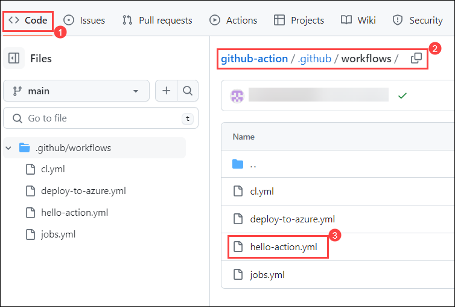
   
1. In the workflow file, click on the **edit** button.

     

1. Copy `#test azure boards` **(1)** code and paste it into line number 1 of the file. Make sure there are no indentation errors.

     
   
1. Click on **Commit Changes** **(2)**, provide the details mentioned below, and click on **Propose changes** **(4)**.

    - Provide `AB#workitem ID Updated` **(1)** as the title. Make sure to provide the same **Work item ID** that was created in the earlier step in Azure DevOps.
    - Select **Create a new branch for this commit and start a pull request** **(2)**, and name the new branch **demo-DevOps** **(3)**.

       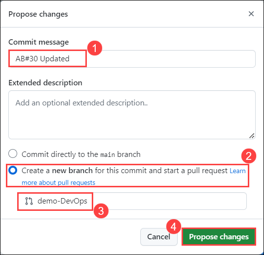
   
1. On the **Open a pull request** tab, click on **Create pull request.** 

     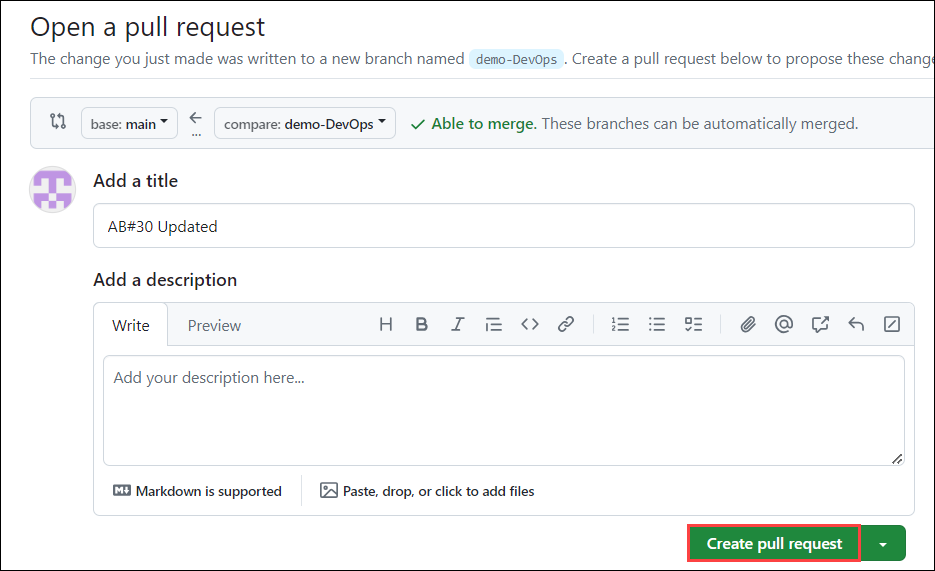
   
1. Navigate to **Azure Boards**. Open the **work item** **(1)** created in the earlier step.

    

1. Observe that the **Pull request** has been linked to the work item.

    
   
1. Navigate back to the GitHub browser tab and select the **Pull requests** tab.

    
   
1. Open the PR created from the **demo-Devops** branch and select **Merge pull request**.

    
   
1. Update the description as **fixed AB#{workitemID} updated (1)** and select **Confirm merge (2)**.

    
   
1. Navigate back to the **Azure Boards** tab and notice that the **work item** has been marked as **done**.

    
