# Lab 6: Integrating with Azure DevOps

## Overview

Azure Boards is a powerful tool within the Azure DevOps suite designed to help teams plan, track, and manage their work. Integrating Azure Boards with GitHub can significantly enhance project management by linking development activities with planning and tracking workflows. Here's how this integration can benefit your team and the steps to set it up:

### Benefits of Integrating Azure Boards with GitHub

- **Unified Workflow**: Sync work items and pull requests between Azure Boards and GitHub, ensuring that all team members have visibility into progress and issues, regardless of the platform they use.
- **Automated Linking**: Automatically link GitHub commits and pull requests to work items in Azure Boards. This creates traceability from code changes to project tasks.
- **Enhanced Collaboration**: Teams can use GitHub for source control and collaboration while leveraging Azure Boards for work item tracking, providing a seamless experience across both platforms.
- **Improved Planning and Tracking**: Plan sprints, track progress, and manage backlogs in Azure Boards while developers continue to use GitHub for their code repositories.

In this exercise, you'll explore Azure boards and Azure test plans. Azure Boards provides software development teams with the interactive and customizable tools they need to manage their software projects. Azure Test Plans provide rich and powerful tools everyone in the team can use to drive quality and collaboration throughout the development process. The easy-to-use, browser-based test management solution provides all the capabilities required for planned manual testing.

## Lab Objectives

- Task 1: Connect the Azure Board with GitHub
- Task 2: Link GitHub Pull Requests to Boards Items
  
### Task 1: Connect the Azure Board with GitHub

In this task, you'll connect your Azure DevOps project's board to your GitHub repository using the Azure Boards app for GitHub to support the integration between Azure Boards and GitHub. This app is free for both public and private repositories. You'll also explore work items.  In this task, you'll make changes in GitHub, link a PR to Azure boards using syntax, and monitor the work item.

1. Navigate to the **IN-PRIVATE** window in your VM.

1. In your browser, open GitHub Marketplace by navigating to the URL provided below:

    ``` 
    https://github.com/marketplace/azure-boards
    ```

    

1. Scroll to the bottom of the page and select `Install it for Free`.

   

    >**Note:** If the **Install it for free** button is grayed out, please proceed to the next step.

1. Please enter the billing details:

    - `First name`: <inject key="AzureAdUserEmail"></inject>
    - `Last name`: <inject key="DeploymentID"></inject>
    - `Address`: Please provide any placeholder address.
    - `City`: Pick the city you want.
    - `State`: Pick the state you want.
    - `Zip`: Provide the postal code.

    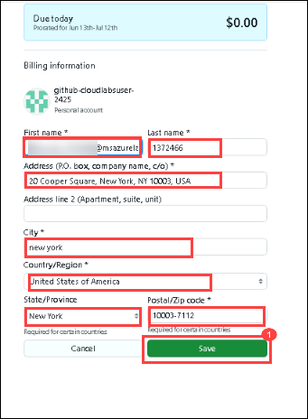
    
1. On the next page, select **Complete order and begin installation**.

1. Click on the **only select repositories (1)** option, select the lab files repository **(2)**, `github-action` **(3)**, that you created earlier, and click on **Install & Authorize (4)**.

   
    
      > **Note**: If you see the message, **You’ve already purchased this on all of your GitHub accounts** this indicates Azure Boards integration is already used in your account. Follow the steps below.

     - On the **Azure Boards Marketplace** page, click the **ellipsis (1)** in the upper right corner and select the **Username (2)**.

         
   
     - In the edit your plan window, select **grant this app access**.
   
       
   
     - Click on the **only select repositories (1)** option. Select the lab files repository **(2)** `github-action` **(3)** that you created earlier and click on **Install & Authorize (4)**.

         

    - Select the cloudlabs **Email**. <inject key="AzureAdUserEmail"></inject>
     
    - Now, enter the password and **click** on **Sign in**.

        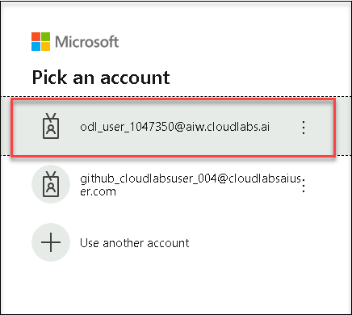.

1. Enter the cloudlabs **Email**. <inject key="AzureAdUserEmail"></inject>

1. Now, enter the password and **click** on **Sign in**.

1. Click on **Create New Organization**.

1. Keep the values as default and click on **Continue**.

     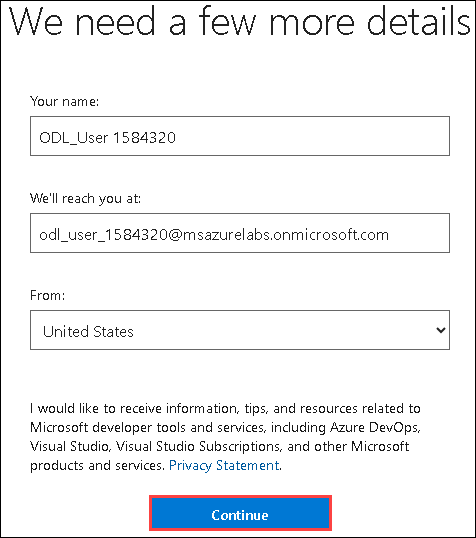.

1. Provide the **CAPTCHA (1)** as per the image and click on **Continue (2)**.

     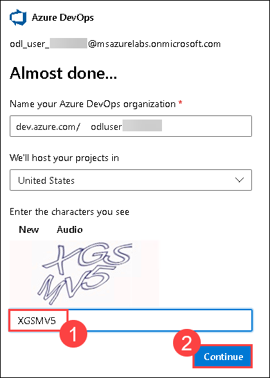.

1. Click on **Continue** on the Get Started with Azure DevOps pop-up.

     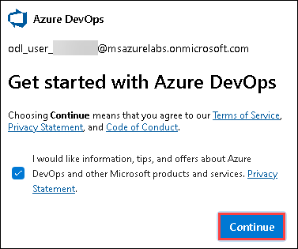.
  
1. Navigate to the organization settings in a new tab and click the checkbox for **Allow public projects**. 

     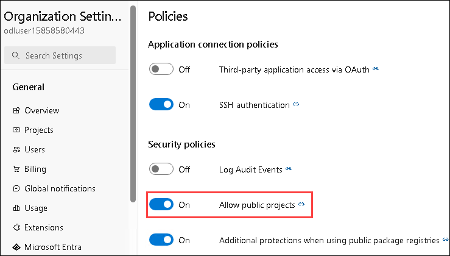.

   > **Note**: Click on **Save** on the Change policy setting pop-up. 

      .

1. Provide the project name as **New-Project (1)**, check the box for **Public (2)** and click on **+ Create project (3)**.

     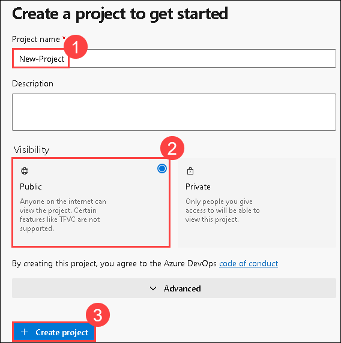.

1. Once the project is created, click on **Boards** from the left pane.

     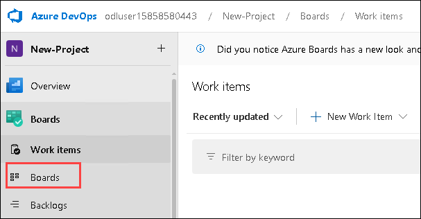.

>**Congratulations** on completing the Task! Now, it's time to validate it. Here are the steps:
> - Hit the Validate button for the corresponding task. If you receive a success message, you have successfully validated the lab. 
> - If not, carefully read the error message and retry the step, following the instructions in the lab guide.
> - If you need any assistance, please contact us at cloudlabs-support@spektrasystems.com.

  <validation step="cd611c8f-8c88-44ac-b8d4-76e45fa50f6a	" />

### Task 2: Link GitHub Pull Requests to Boards Items

In this task, you'll make changes to the GitHub link, send a PR to Azure boards using syntax, and monitor the work item.

1. In the **Azure Boards** tab, click on **New Item** **(1)**, provide **Test DevOps Action** **(2)** as a description, and create a new work item by hitting **enter**.

     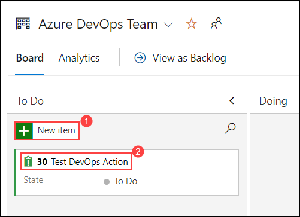
   
1. After creating a work item, please note down the work item ID, which will be used in the next steps.

     
   
1. Select the **Code** **(1)** tab in your GitHub repository. Navigate to **.github/workflows/** **(2)** and select a file out of any of the workflows you had previously created **(3)**.

     
   
1. In the workflow file, click on the **edit** button.

     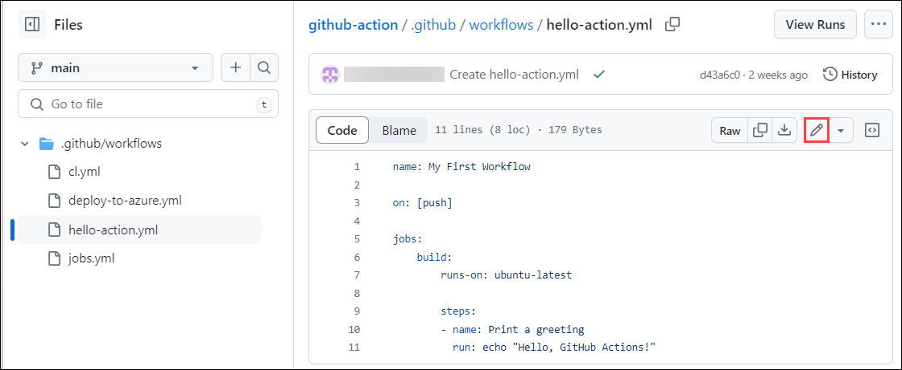

1. Copy `#test azure boards` **(1)** code and paste it into line number 1 of the file. Make sure there are no indentation errors.

     
   
1. Click on **Commit Changes** **(2)**, provide the details mentioned below, and click on **Propose changes** **(4)**.

    - Provide `AB#workitem ID Updated` **(1)** as the title. Make sure to provide the same **Work item ID** that was created in the earlier step in Azure DevOps.
    - Select **Create a new branch for this commit and start a pull request** **(2)**, and name the new branch **demo-DevOps** **(3)**.

       
   
1. On the **Open a pull request** tab, click on **Create pull request.** 

     
   
1. Navigate to **Azure Boards**. Open the **work item** **(1)** created in the earlier step.

    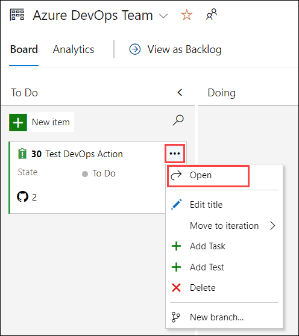

1. Observe that the **Pull request** has been linked to the work item.

    
   
1. Navigate back to the GitHub browser tab and select the **Pull requests** tab.

    
   
1. Open the PR created from the **demo-Devops** branch and select **Merge pull request**.

    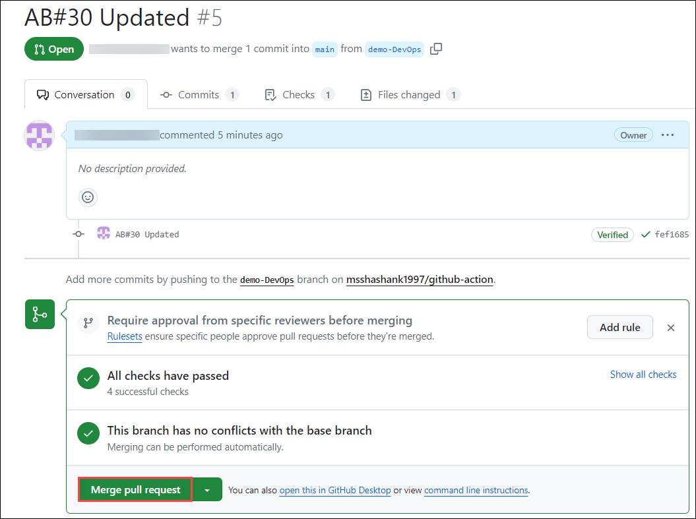
   
1. Update the description as **fixed AB#{workitemID} updated (1)** and select **Confirm merge (2)**.

    
   
1. Navigate back to the **Azure Boards** tab and notice that the **work item** has been marked as **done**.

    

## Summary

In this exercise, you have successfully connect the Azure Board with GitHub and linked GitHub Pull Requests to Boards Items.

### You have successfully completed the lab!
