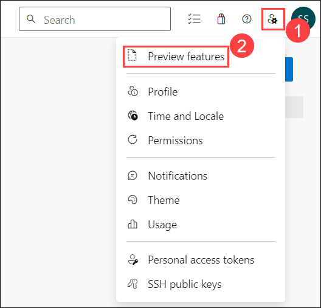
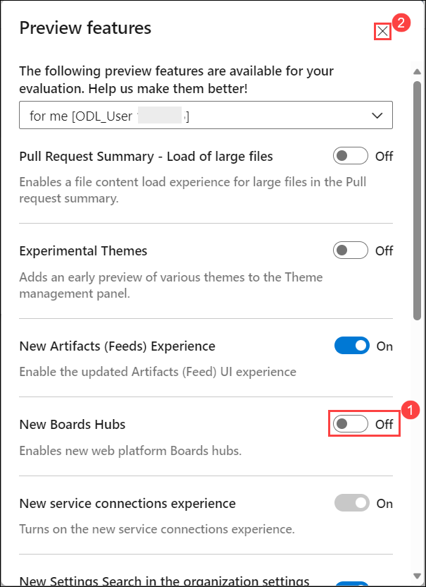
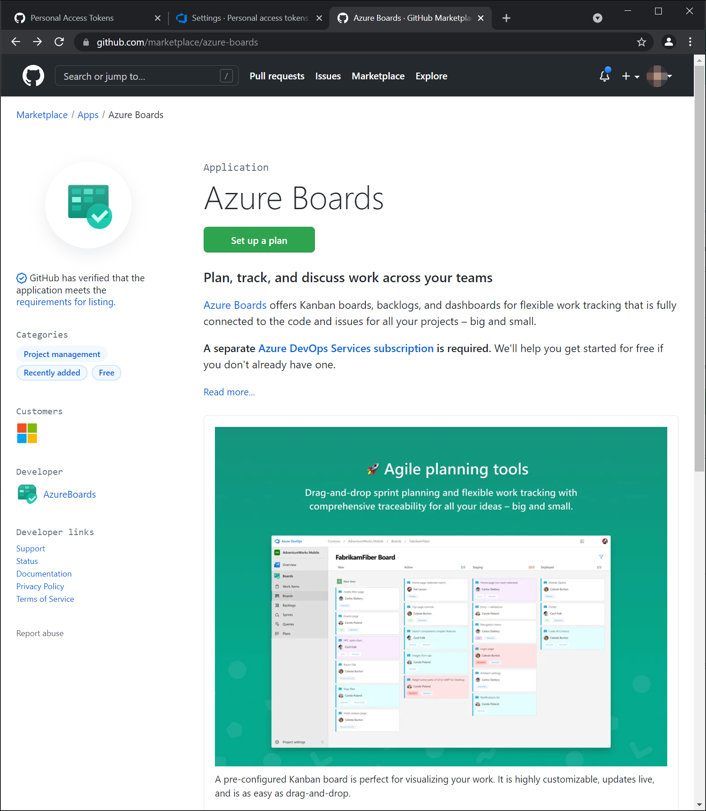
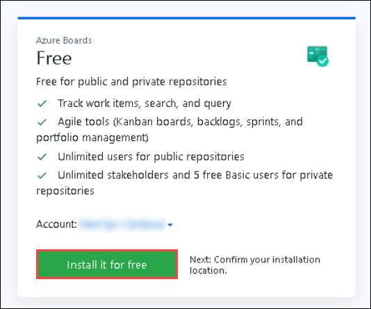
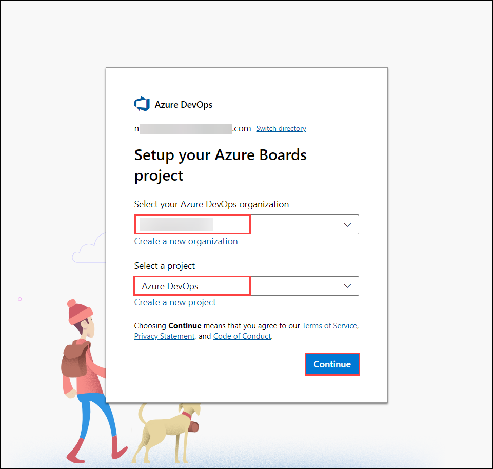
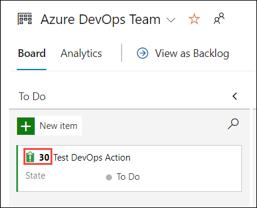
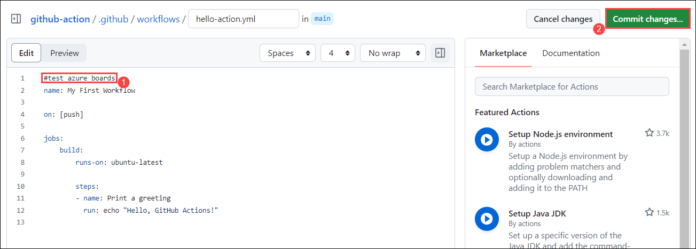
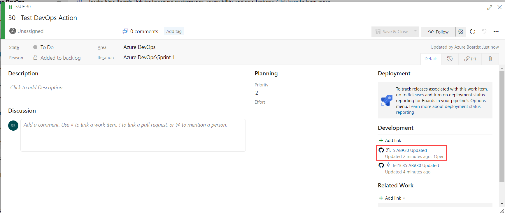
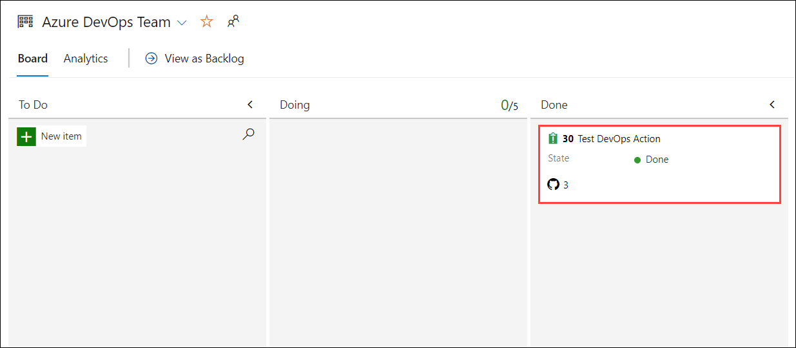

In this exercise, you'll explore Azure boards and Azure test plans. Azure Boards provides software development teams with the interactive and customizable tools they need to manage their software projects. Azure Test Plans provides rich and powerful tools everyone in the team can use to drive quality and collaboration throughout the development process. The easy-to-use, browser-based test management solution provides all the capabilities required for planned manual testing.

### Task 1: Connect Azure Board with GitHub

In this task, you will connect your Azure DevOps project's board to your GitHub repository using the Azure Boards app for GitHub to support the integration between Azure Boards and GitHub. This app is free for both public and private repositories. You'll also explore work items.  In this task, you'll make changes in GitHub link a PR to Azure boards using syntax, and monitor the work item.

1. In your browser open Azure DevOps by navigating to the below URL:

    ``` 
    https://dev.azure.com/aiw-devops/
    ```

2. In the Azure DevOps page click on the **User settings** **(1)** from the top right corner of the page and click on **Preview features** **(2)**.

   

    > **Note:** If you get a sign-in error, then click on **Sign out and sign with a different account** link and login with your ODL user's Azure credentials. In the next page, leave the details to default and proceed. You should be logged in to the Azure DevOps organization. 

3. In the **Preview features** pop-up, ensure to set the toggle button to **off** for **New Boards Hubs** **(1)** and close the preview features by clicking on **X** **(2)**.
   
   

4. In your browser open GitHub Marketplace by navigating to the below URL:

    ``` 
    https://github.com/marketplace/azure-boards
    ```

    

5. Scroll to the bottom of the page and select `Install it for Free.`

   

    >**Note:** If the **Install it for free** button is greyed out, please proceed to next step.
   
6. On the next page, select **Complete order and begin installation**.

7. Select the lab files repository `aiw-devops-with-github-lab-files` which you created earlier and click on **Install & Authorize**.

   
    
    >**Note**: If you see the message **You’ve already purchased this on all of your GitHub accounts** this indicates Azure Boards integration is already used in your account, follow the below steps.
   
   - Scroll to the top of the Azure Boards Marketplace page and select **grant this app access to your GitHub account**.
   
       
   
   - Select the lab files repository `aiw-devops-with-github-lab-files` which you created earlier and click on **Install & Authorize**.

       

   - Select the cloudlabs **Email** <inject key="AzureAdUserEmail"></inject>
     
   - Now enter the password and **click** on **Sign in**.

        .
    
8. Select the **aiw-devops (1)** Azure DevOps organization and select the **Contosotraders-<inject key="DeploymentID" enableCopy="false" /> (2)** project then click on **Continue (3)**

   

9. In the Azure Boards tab, click on **New Item** ***(1)***, provide **Update carts** **(2)** as a description and create a new work item by hitting **enter**.

   
   
10. After creating a work item, Please note down the Work item ID which will be used in the further steps.

    
   
11. Select the **Code** ***(1)*** tab in your GitHub repository, navigate to **aiw-devops-with-github-lab-files/.github/workflows/** ***(2)*** and select **contoso-traders-provisioning-deployment.yml** ***(3)*** file.

    
   
12. Copy `#test azure boards` code and paste it into line number 1 of the file. Make sure there are no indentation errors.

    
   
13. Click on **Commit Changes** ***(1)***, provide the details mentioned below and click on **Propose changes** ***(5)***.

   - Provide `workitem ID Updated` ***(2)*** as title. Make sure to provide the same **Work item ID** that was created in the earlier step in Azure DevOps.
   - Select **Create a new branch for this commit and start a pull request** ***(3)***  and name the new branch as **update carts** ***(4)***.

       
   
14. On Open a pull request tab, Click on **Create pull request** 

    
   
15. Navigate to **Azure Boards**. Open the **work item** ***(1)*** created in the earlier step.

    

16. Observe that the **Pull request** has been linked to the work item.

    
   
17. Navigate back to the GitHub browser tab and select **Pull requests** tab.

    
   
18. Open the PR created from **updated carts** branch and select **Merge pull request**.

    
   
19. Update the description as **fixed AB#{workitemID} updated** and select **confirm merge**.

    
   
20. Navigate back Azure Boards tab and notice that the **work item** has been marked as **done**.

    
