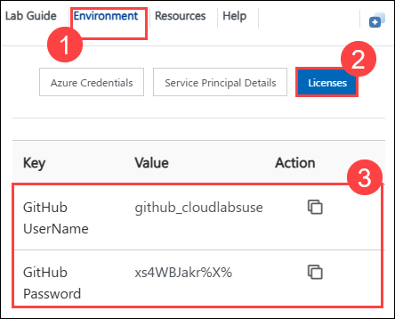
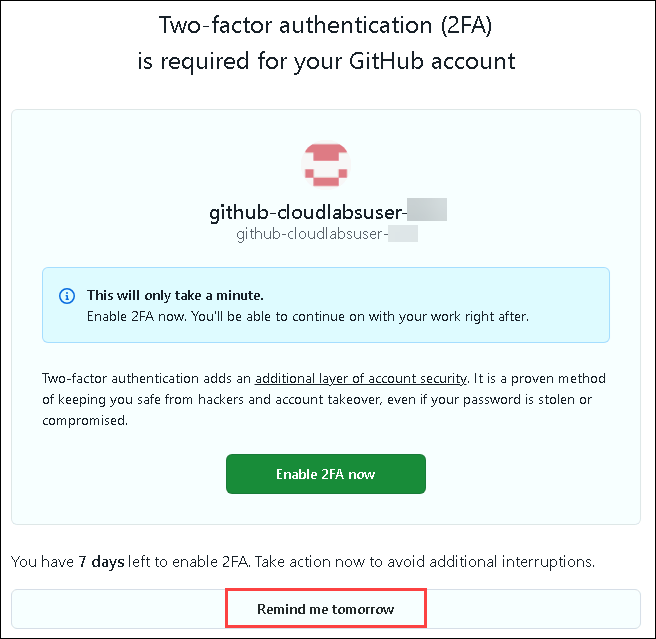
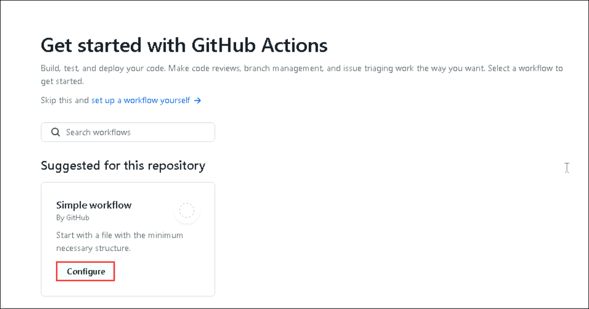
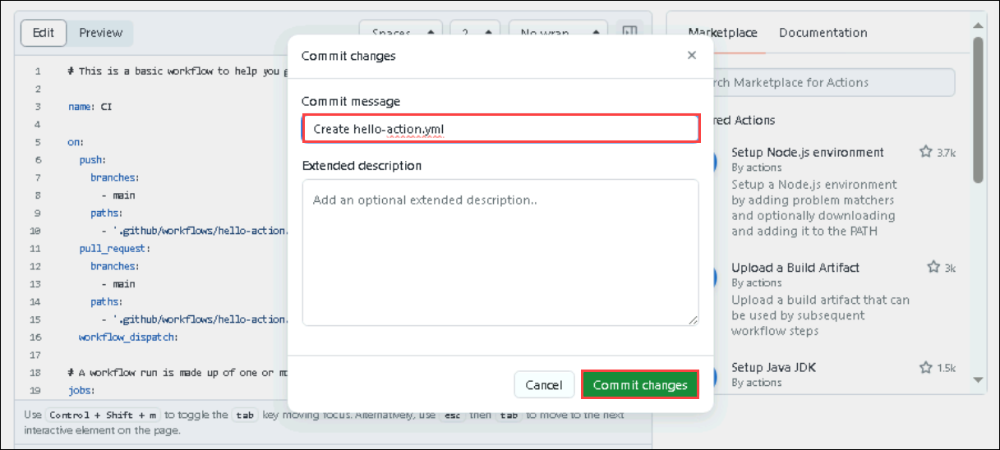
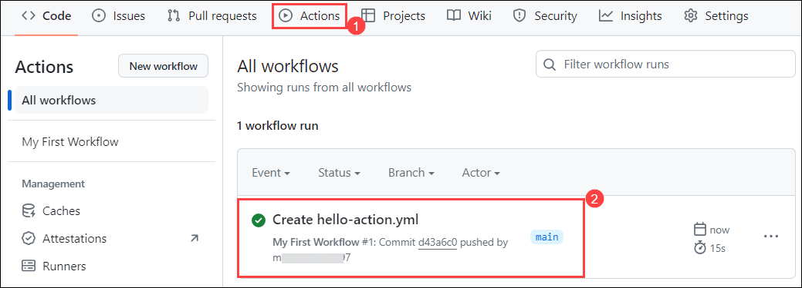

# Lab 1: Workflow Setup 

## Overview

A GitHub repository (repo) is a central location where the files for a project are stored and managed using Git, a version control system. A repository contains all the project's files, including code, documentation, and other assets, along with a history of all changes made to those files.

## Lab Objectives

- Task 1: Create the Project Repo
- Task 2: Introduction to GitHub Actions
- Task 3: Create a Custom Workflow with Multiple Jobs


### Task 1: Create the Project Repo

In this task, you'll learn to create a GitHub repository.

1. Select **Microsoft Edge** from the desktop, open a new browser tab and navigate to the GitHub login page at ```https://www.github.com/login```. From **Environment Details** page **(1)**, navigate to the **Licenses** **(2)** tab and **copy** **(3)** the credentials. Use the same username and password to log into GitHub.

    

1. To retrieve the **Device Verification Code**, use your existing credentials. Begin by opening a private browsing window and navigating to ```http://outlook.office.com/``` Enter the same username and password you used to log into your GitHub account. Once logged in, locate the **verification code** displayed on the screen. **Copy** this code and then **paste** it into the **Device Verification** section where prompted. This ensures you can securely complete the device verification process using the credentials associated with your GitHub account.

    

   >**Note:** In case you're prompted with Two factor authentication, please click on **Remind me Tomorrow**.

       

1. In the upper-right corner, navigate to the user menu and select **Your repositories** **(1)**.

   

1. Next to the search criteria, locate and select the **New** option.

   

1. On the **Create a new repository** screen, name the repository ```github-action``` **(1)**, select **Public** **(2),** and click on the **Create repository** **(3)** button.

   
   
   >**Note:** If you encounter an error like **The repository github-action already exists on this account**, please delete it before creating a new one. Follow the steps below to do so. If there is no repository with the same name, proceed directly to **Task 2.**

      .png "New Repository Creation Form")

   - In the upper-right corner, navigate to the user menu and select **Your repositories** **(1)**.
   
      

   - Using the search bar, search for ```github-action``` **(1)** and open it **(2)**.

      

   - From the GitHub repository, click on the **Settings** tab.

      

   - Once on the **settings** page, scroll to the bottom and select **Delete this repository**.

      

   - On the `{github-username}/github-action` delete pop-up, click on the **I want to delete this repository** option.

      

   - Moving on, in the same `{github-username}/github-action` delete pop-up, click on the **I have read and understand these effects** option.

      

   - To confirm your decision, copy the **repository name** **(1)** available in the `{github-username}/github-action` pop-up. Paste it in the **box** **(2)**, and click on  **Delete this repository** **(3)** option.

      

   - Navigate back to step 3 and create the repository as instructed. 

>**Congratulations** on completing the Task! Now, it's time to validate it. Here are the steps:
> - Hit the Validate button for the corresponding task. If you receive a success message, you have successfully validated the lab. 
> - If not, carefully read the error message and retry the step, following the instructions in the lab guide.
> - If you need any assistance, please contact us at cloudlabs-support@spektrasystems.com.

   <validation step="f7d6235a-c657-42b0-ae75-67deeba0f0c9" />

## Task 2: Introduction to GitHub Actions

GitHub Actions is a powerful automation tool provided by GitHub, allowing you to automate your software development workflows directly within your GitHub repository. With GitHub Actions, you can build, test, and deploy your code without leaving GitHub, saving time and improving collaboration among your team members.

In this task, you'll create a simple GitHub action and understand the components of a workflow file.

1. Navigate to the **Actions** directory in the newly created repository.

      

1. In the `Get started with GitHub Actions` page, click on the **Configure** button available in the **Simple Workflow** section.

      

1. You'll be able to see a very simple workflow that prints a few text sentences as output.    

      .png)

     > **Note**: This workflow provides a basic template for setting up CI with GitHub Actions. It checks out the repository code, runs a simple one-line script, and then runs a multi-line script. You can expand this workflow by adding more steps to build, test, and deploy your project. Here's the complete explanation of the workflow file.

      - **Workflow Name**: The workflow is named **"CI,"** which stands for **Continuous Integration**. When the workflow runs:

      - **The workflow is triggered by specific events**:
      
         *Push*: The workflow runs whenever changes are pushed to the main branch.

         *Pull Request*: The workflow runs whenever a pull request is made to the main branch.

         *Manual Trigger*: The workflow can also be manually triggered from the Actions tab in the GitHub repository (using workflow_dispatch).

     - **Jobs**: A workflow is made up of one or more jobs. In this case, there is a single job called "build." In the next task, you'll create a workflow with multiple jobs and learn about it in detail.

    - **Runner**: The job runs on a virtual machine (runner) provided by GitHub. Here, it uses the latest version of Ubuntu (ubuntu-latest).

    - **Steps**: The job contains a sequence of steps, each representing a task to be executed.

    - **Checkout Repository**:

      *uses*: actions/checkout@v4: This step checks out the repository, making the code available to the workflow.

    - **Run a One-Line Script**:

      *run*: echo Hello, world!: This step runs a simple command in the runner's shell, which prints "Hello, world!" to the console.

    - **Run a Multi-Line Script**:

      *run*: |:
      This step runs multiple commands. The | character allows you to write multiple lines of script. The commands in this step print two lines:

      "Add other actions to build,"

      "Test and deploy your project."  

         > **Note**: For more information, read the [GitHub Actions](https://docs.github.com/en/actions/learn-github-actions/understanding-github-actions) documentation.

1. Include the file name as **hello-action.yml** **(1)**. In the editor, **copy and paste** **(2)** the below script, and click on the **Commit changes** **(3)** option.

      ```
      # This is a basic workflow to help you get started with Actions
   
      name: CI
   
      on:
        push:
          branches:
            - main
          paths:
            - '.github/workflows/hello-action.yml'
        pull_request:
          branches:
            - main
          paths:
            - '.github/workflows/hello-action.yml'
        workflow_dispatch:
   
      # A workflow run is made up of one or more jobs that can run sequentially or in parallel
      jobs:
      # This workflow contains a single job called "build"
        build:
          runs-on: ubuntu-latest
          steps:
            - uses: actions/checkout@v4
   
            # Runs a single command using the runners shell
            - name: Run a one-line script
              run: echo Hello, world!
   
            # Runs a set of commands using the runners shell
            - name: Run a multi-line script
              run: |
                echo Add other actions to build,
                echo test, and deploy your project.
      ```

      .png)

1. In the **Commit Changes** pop-up window, click on the **Commit changes** option.

      

1. Click on **Actions** **(1)**, once the workflow is succeeded, click on Workflow: **Create hello-action.yml** **(2)**.

      

1. Click on the **build** option under Jobs. You can see the steps and output. .

      

      > **Note:** The GitHub Actions workflow, named "CI," triggers pushes to the main branch affecting **.github/workflows/hello-action.yml**, pull requests to main with changes to the same file, and can be manually triggered **(workflow_dispatch)**. It features a single job **(build)** running on Ubuntu, utilizing **actions/checkout@v4** to fetch the repository. The job executes a one-line script printing "Hello, world!" and a multi-line script for additional build, test, and deployment actions.

>**Congratulations** on completing the Task! Now, it's time to validate it. Here are the steps:
> - Hit the Validate button for the corresponding task. If you receive a success message, you have successfully validated the lab. 
> - If not, carefully read the error message and retry the step, following the instructions in the lab guide.
> - If you need any assistance, please contact us at cloudlabs-support@spektrasystems.com.

   <validation step="0cd73fbd-d13e-4122-b85e-59b2e62b7b90" />

## Task 3: Create a Custom Workflow with Multiple Jobs

In GitHub Actions workflows, you define jobs and steps to orchestrate the tasks you want to automate. Jobs represent the individual units of work that can run in parallel or sequentially, while steps are the individual tasks performed within a job. Let's dive deeper into defining jobs and steps within workflows:

**Defining Jobs**: Jobs are defined within the `jobs` section of your workflow file. Each job consists of a series of steps that are executed sequentially by default. However, you can configure jobs to run in parallel by specifying dependencies between them. Here's how you define jobs within a workflow:
   
**Defining Steps**: Steps are the individual tasks performed within a job. Each step represents a specific action or command that GitHub Actions executes as part of the workflow. Steps can include checking out code, installing dependencies, running tests, deploying applications, and more. Here's how you define steps within a job:

1. Navigate to the **Code** **(1)** tab and click on the **.github/workflows** **(2)** folder.

      

1. In the **.github/workflows** folder, click on **Add file** **(1)** and select the **+ Create new file** **(2)** option.

      

1. Include the file name as **jobs.yml** **(1)**. In the editor, **copy and paste** **(2)** the script given below, and click on the **Commit changes** **(3)** option.

      ```
      # This is the configuration for our GitHub Actions workflow.
      # The workflow is triggered on push and pull request events targeting the main branch.
      name: My Workflow
   
      on:
        push:
          branches:
            - main
          paths:
            - '.github/workflows/jobs.yml'
        pull_request:
          branches:
            - main
          paths:
            - '.github/workflows/jobs.yml'
        workflow_dispatch:
   
      jobs:
          # Job 1 runs first
          job1:
              runs-on: ubuntu-latest
              steps:
              # Step to checkout the code from the repository
              - name: Checkout code
                uses: actions/checkout@v2
              # Step to run a simple script
              - name: Run a script
                run: echo "Hello, world!"
          # Job 2 depends on the successful completion of Job 1
          job2:
              runs-on: ubuntu-latest
              needs: job1
              steps:
              # Step to checkout the code from the repository
              - name: Checkout code
                uses: actions/checkout@v2
              # Step to run another simple script
              - name: Run another script
                run: echo "Hello, again!"
      ```
      .png)
   
 1. In the **Commit changes** pop-up window, click on the **Commit changes (1)** option.

       

    - You can customize the events and branches for triggering the workflow according to your project's requirements. For example, you might want to trigger the workflow only on pushes to the `main` branch or on pull requests targeting the `main` branch.

    - You can also add more jobs and steps to perform tasks like building, testing, deploying, or any other actions you need your workflow to perform.

    - For more details on GitHub Actions Syntax and available events, refer to the official documentation: [GitHub Actions - Workflow Syntax for GitHub Actions](https://docs.github.com/en/actions/reference/workflow-syntax-for-github-actions).

1. Click on **Actions** **(1)**, and verify the workflow has been executed successfully. Once the workflow is succeeded select the newly created workflow **Create jobs.yml** **(2)**.

      

1. Verify the jobs, and feel free to go through the workflow.

      

    > **Note:** This GitHub Actions workflow named "My Workflow" triggers on pushes and pull requests to the main branch, specifically for changes to the **.github/workflows/jobs.yml** file, and can also be manually triggered **(workflow_dispatch)**. It consists of two jobs: **job1**, which checks out the repository and runs a script printing "Hello, world!", and **job2**, dependent on **job1**, which checks out the repository again and runs another script printing "Hello, again!" sequentially on an Ubuntu environment.

>**Congratulations** on completing the Task! Now, it's time to validate it. Here are the steps:
> - Hit the Validate button for the corresponding task. If you receive a success message, you have successfully validated the lab. 
> - If not, carefully read the error message and retry the step, following the instructions in the lab guide.
> - If you need any assistance, please contact us at cloudlabs-support@spektrasystems.com.

   <validation step="39bc50c7-eb88-462f-b0dd-c5407a0f313e" />

## Summary

In this lab, you've successfully set up our workflow. You've also created and executed a workflow, verified its successful execution, and familiarized yourself with the jobs within it. This foundational knowledge will be instrumental as we progress through the subsequent labs.

### You have successfully completed the lab!
