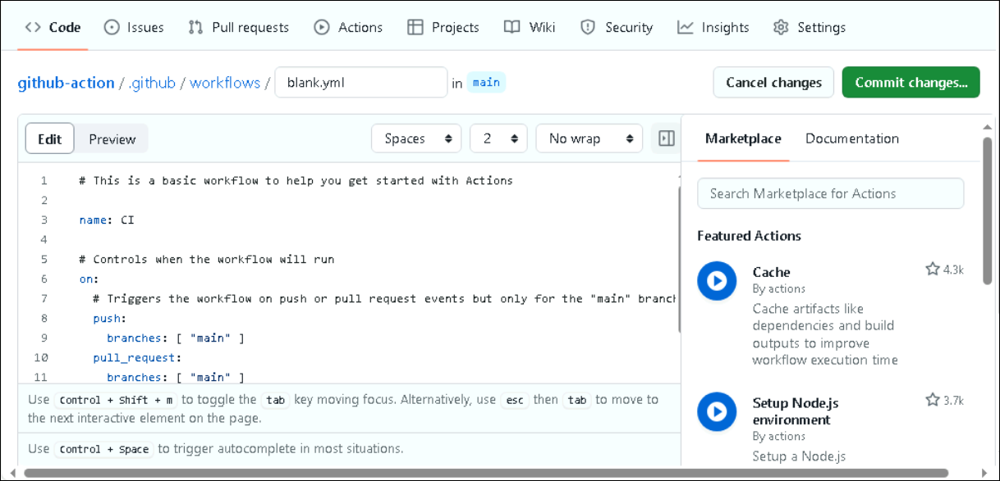
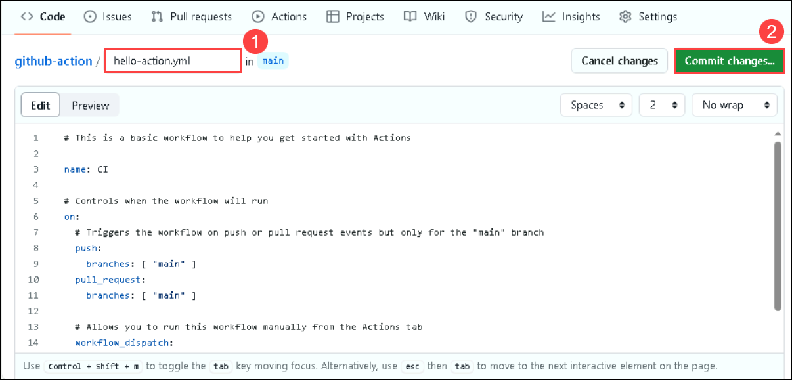
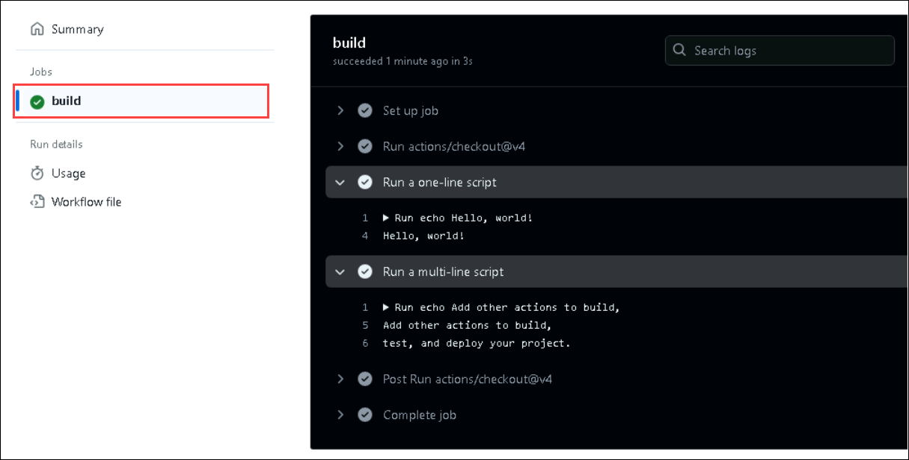

# Lab 1: Workflow Setup 

## Task 1: Create the Project Repo

In this task, you'll access the GitHub enterprise account and create a new repository to store the infrastructure.

In this task, you will create an account in [GitHub](https://github.com) and use `git` to add lab files to a new repository.

1. In the labvm-<inject key="DeploymentID" enableCopy="false"/>, open a new browser tab and navigate to the GitHub login page at ```https://www.github.com/login```. From Environment details page ***(1)***, navigate to **License** ***(2)*** tab and **copy** ***(3)*** the credentials. Use the same username and password to login into GitHub.

    

1. To retrieve the **Device Verification Code**, use your existing credentials as before. Begin by opening a private browsing window and navigating to http://outlook.office.com/. Enter the same username and password used to log into your GitHub account. Once logged in, locate the verification code displayed on the screen. Copy this code and then paste it into the Device Verification section where prompted. This ensures you can securely complete the device verification process using the credentials associated with your GitHub account.

    

1. In the upper-right corner, navigate to the user menu and select **Your repositories** ***(1)***.

   

1. Next to the search criteria, locate and select the **New** button.

   

1. On the **Create a new repository** screen, name the repository ```github-action``` ***(1)***, select **Public** ***(2)*** and click on **Create repository** ***(3)***  button.

   
   
   >**Note:** If you encounter an error like **The repository github-action already exists on this account**, please delete it before creating a new one. Follow the steps below to do this. If there is no repository with the same name, proceed directly to Task 2.

      .png "New Repository Creation Form")

   - In the upper-right corner, navigate to the user menu and select **Your repositories** ***(1)***.
   
      

   - Using the search bar, search for ```github-action``` **(1)** and select to open it.

      

   - From the GitHub repository, click on the **Settings** tab.

      

   - In the settings page, scroll to the bottom of the page and select **Delete this repository**.

      

   - In the pop of delete `{github-username}/github-action` click on **I want to delete this repository**.

      

   - In the pop of delete `{github-username}/github-action` click on **I have read and understand these effects**.

      

   - In the pop of delete `{github-username}/github-action` to conform, Copy the **repository name** **(1)**, paste it in the **box** **(2)**, and click on I understand the consequences, **Delete this repository** **(3)**.

      

## Task 2: Introduction to GitHub Actions

GitHub Actions is a powerful automation tool provided by GitHub, allowing you to automate your software development workflows directly within your GitHub repository. With GitHub Actions, you can build, test, and deploy your code without leaving GitHub, saving time and improving collaboration among your team members.

1. Navigate to the **Actions** directory in your repository.

    

1. In the `Get started with GitHub Actions` page, click on the **Configure** button on the Simple Workflow.

    

1. You'll be able to see a very simple workflow which prints a few text sentences as output.    

    

   This workflow provides a basic template for setting up CI with GitHub Actions. It checks out the repository code, runs a simple one-line script, and then runs a multi-line script. You can expand this workflow by adding more steps to build, test, and deploy your project. Here's the complete explanation of the workflow file.

   - **Workflow Name**: The workflow is named "CI", which stands for Continuous Integration.
When the Workflow Runs:

    - **The workflow is triggered by specific events**:
      
      *Push*: The workflow runs whenever changes are pushed to the main branch.

      *Pull Request*: The workflow runs whenever a pull request is made to the main branch.

      *Manual Trigger*: The workflow can also be manually triggered from the Actions tab in the GitHub repository (using workflow_dispatch).

    - **Jobs**:A workflow is made up of one or more jobs. In this case, there is a single job called "build". In the next task, you will create an workflow with mutliple jobs and learn about it in detail.

    - **Runner**: The job runs on a virtual machine (runner) provided by GitHub. Here, it uses the latest version of Ubuntu (ubuntu-latest).

    - **Steps**: The job contains a sequence of steps, each representing a task to be executed.

    - **Checkout Repository**:

      *uses*: actions/checkout@v4: This step checks out the repository, making the code available to the workflow.

    - **Run a One-Line Script**:

      *run*: echo Hello, world!: This step runs a simple command in the runner's shell, which prints "Hello, world!" to the console.

    - **Run a Multi-Line Script**:

      *run*: |:
      This step runs multiple commands. The | character allows you to write multiple lines of script. The commands in this step print two lines:

      "Add other actions to build,"

      "test, and deploy your project."  

   For more information, read [GitHub Actions](https://docs.github.com/en/actions/learn-github-actions/understanding-github-actions) documentation.

1. Provider file name as **hello-action.yml** **(1)**, in the editor **copy and paste** **(2)** the below script, and click in **Commit changes** **(3)**.

   ```
   # This is a basic workflow to help you get started with Actions

   name: CI

   on:
     push:
       branches:
         - main
       paths:
         - '.github/workflows/hello-action.yml'
     pull_request:
       branches:
         - main
       paths:
         - '.github/workflows/hello-action.yml'
     workflow_dispatch:

   # A workflow run is made up of one or more jobs that can run sequentially or in parallel
   jobs:
   # This workflow contains a single job called "build"
     build:
       runs-on: ubuntu-latest
       steps:
         - uses: actions/checkout@v4

         # Runs a single command using the runners shell
         - name: Run a one-line script
           run: echo Hello, world!

         # Runs a set of commands using the runners shell
         - name: Run a multi-line script
           run: |
             echo Add other actions to build,
             echo test, and deploy your project.
   ```

   

   >**Note:** This GitHub Actions workflow, named "CI", triggers on pushes to the main branch affecting .github/workflows/hello-action.yml, pull requests to main with changes to the same file, and can be manually triggered (workflow_dispatch). It features a single job (build) running on Ubuntu, utilizing actions/checkout@v4 to fetch the repository. The job executes a one-line script printing "Hello, world!" and a multi-line script for additional build, test, and deployment actions.

1. In the pop up windows of **Commit Changes** click on the **Commit changes**.

    .png)

1. Click on **Actions** **(1)**, once the workflow got succedded click on Workflow **hello-action.yml** **(2)**.

   

1. Click on the action and select **build**. You can see the steps and output.

    

## Task 3: Create a Custom workflow with multiple Jobs

In GitHub Actions workflows, you define jobs and steps to orchestrate the tasks you want to automate. Jobs represent the individual units of work that can run in parallel or sequentially, while steps are the individual tasks performed within a job. Let's dive deeper into defining jobs and steps within workflows:

**Defining Jobs**: Jobs are defined within the `jobs` section of your workflow file. Each job consists of a series of steps that are executed sequentially by default. However, you can configure jobs to run in parallel by specifying dependencies between them. Here's how you define jobs within a workflow:
   
**Defining Steps**: Steps are the individual tasks performed within a job. Each step represents a specific action or command that GitHub Actions executes as part of the workflow. Steps can include checking out code, installing dependencies, running tests, deploying applications, and more. Here's how you define steps within a job:

1. Navigate to the **Code** **(1)** and click on **.github/workflows** **(2)** folder.

    

1. In the **.github/workflows** folder, click on **Add files** **(1)**, and click on **+ Create new file** **(2)**.

    

1. Provider file name as **jobs.yml** **(1)**, in the editor **copy and paste** **(2)** the below script, and click in **Commit changes** **(3)**.

   ```
   # This is the configuration for our GitHub Actions workflow.
   # The workflow is triggered on push and pull request events targeting the main branch.
   name: My Workflow

   on:
     push:
       branches:
         - main
       paths:
         - '.github/workflows/jobs.yml'
     pull_request:
       branches:
         - main
       paths:
         - '.github/workflows/jobs.yml'
     workflow_dispatch:

   jobs:
       # Job 1 runs first
       job1:
           runs-on: ubuntu-latest
           steps:
           # Step to checkout the code from the repository
           - name: Checkout code
             uses: actions/checkout@v2
           # Step to run a simple script
           - name: Run a script
             run: echo "Hello, world!"
       # Job 2 depends on the successful completion of Job 1
       job2:
           runs-on: ubuntu-latest
           needs: job1
           steps:
           # Step to checkout the code from the repository
           - name: Checkout code
             uses: actions/checkout@v2
           # Step to run another simple script
           - name: Run another script
             run: echo "Hello, again!"
   ```
    
   
 1. In the pop up windows of **Commit changes** click on the **Commit changes (1)**.

    

    - You can customize the events and branches for triggering the workflow according to your project's requirements. For example, you might want to trigger the workflow only on pushes to the `main` branch or on pull requests targeting the `main` branch.

    - You can also add more jobs and steps to perform tasks like building, testing, deploying, or any other actions you need your workflow to perform.

    - For more details on GitHub Actions syntax and available events, refer to the official documentation: [GitHub Actions - Workflow syntax for GitHub Actions](https://docs.github.com/en/actions/reference/workflow-syntax-for-github-actions).

1. Click on **Actions** **(1)**, verify the workflow has been executed successfully once the workflow is succedded select the newly created workflow **Create jobs.yml** **(2)**.

   

1. Verify the jobs and feel free to go through the workflow.

   

1. Click on **Next** button for next Lab.

## Summary

In this lab, you have successfully set up our workflow. You have created and executed a workflow, verified its successful execution, and familiarized yourself with the jobs within it. This foundational knowledge will be instrumental as we progress through the subsequent labs.
