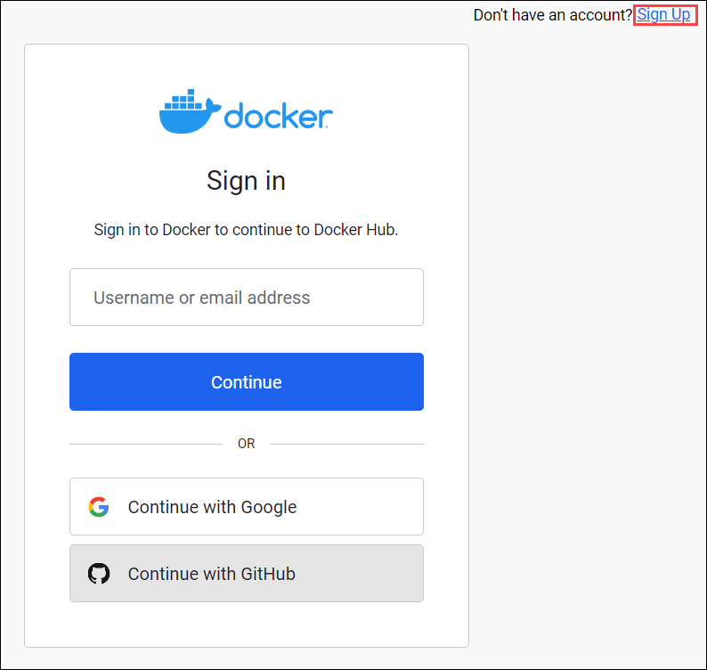
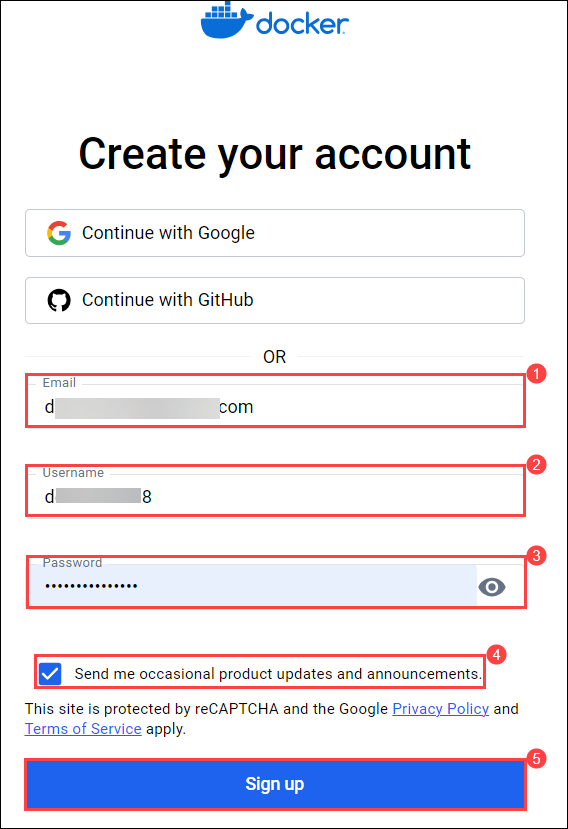
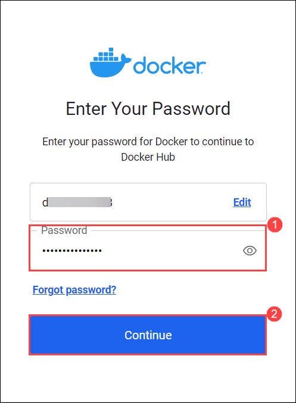
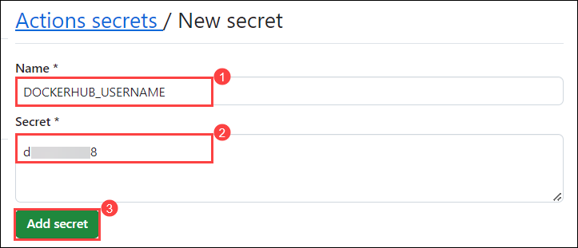

# Lab 2: Action Integration

## Task 1: Incorporating pre-built actions from the GitHub Marketplace

GitHub Marketplace is a central location for you to find actions created by the GitHub community. These actions can be incorporated into your workflows to automate common tasks without having to write the code yourself.

Here's how you can incorporate a pre-built action from the GitHub Marketplace:

1. In the Egde browser add a new tab and navigate `https://login.docker.com/u/login` page if you already having an Docker hub account **enter Username or email address** **(1)** and click on **Continue** **(2)**.

    

2. If you don't have account in the Docker Hub click on `sign up`.

    

3. In the sign up page of Docker Hub enter you **personal email id** **(1)**, proivde a unique **Username** **(2)**, provide a **Password** **(3)**, click on check box for **Send me occasional product updates and announcements** **(4)**, and click on **Sign Up** **(5)**. Perform Step 3

    

4. Enter the **Password** **(1)** and click on **Continue** **(2)**.

    

5. Login to the Personal Email and **Verify Email Address** send by docker.

6. In the Docker Hub tab click on **Profile** **(1)** and click on **My Account** **(2)**.

   

7. In the Docker Hub my account tab click on **Security** **(1)** and click on **New Access Token** **(2)**.

   

8. In **New Access Token** pop-up, enter the Access Token Description as **docker-demo** **(1)**, and click on **Generate** **(2)**.

    

9. In **Copy Access Token** pop-up, click on **Copy and Close** button and paste the coped access token in a notepad for future.

    

10. Navigate back to the `github-action` repo, from the GitHub repository,  select the **Settings** tab from the lab files repository.

    

11. Under **Security**, expand **Secrets and variables** **(1)** by clicking the drop-down and select **Actions** **(2)** blade from the left navigation bar. Select the **New repository secret** **(3)** button.

    

12. Under **Actions Secrets/New secret page**, enter the below mentioned details and Click on **Add secret** **(3)**.

    - Name : Enter **DOCKERHUB_USERNAME** **(1)**
    - Value : Enter the your **Username** **(2)** of Docker hub.

        

13. Once the secret has been created click on **Add secret**.

    

14. Under **Actions Secrets/New secret page**, enter the below mentioned details and Click on **Add secret** **(3)**.

    - Name : Enter **DOCKERHUB_TOKEN** **(1)**
    - Value : Enter the **PAT** **(2)** of Docker hub which you coped in Step 9.

        

11. **Find an Action**: Browse the [GitHub](https://github.com/marketplace?type=actions) Marketplace to find an action that suits your needs. You can search by keywords, categories, or use filters to narrow down the results.
