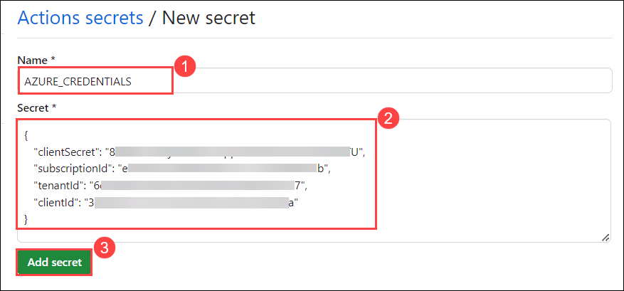
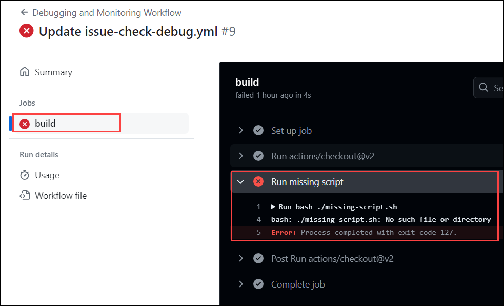
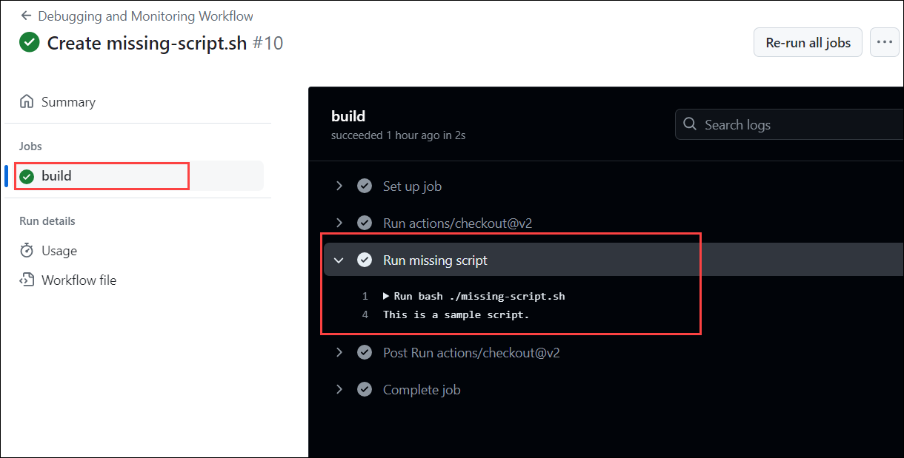

# Lab 5: Security and Best practices

### Task 1: OIDC to securely connect to the cloud

OpenID Connect (OIDC) allows your GitHub Actions workflows to access resources in Azure, without needing to store the Azure credentials as long-lived GitHub secrets. This gives an overview of how to configure Azure to trust GitHub's OIDC as a federated identity, and includes a workflow example for the azure/login action that uses tokens to authenticate to Azure and access resources.

1. Navigate back to the `github-action` repo, from the GitHub repository, and select the **Settings** tab from the lab files repository.

    

2. Under **Security**, expand **Secrets and variables** **(1)** by clicking the drop-down and select **Actions** **(2)** blade from the left navigation bar.

   

3. Under **Actions Secrets/New secret page**, enter the below mentioned details and Click on **Add secret** **(3)**.

   

4. Navigate to **Environment Details** **(1)**, click on **Service Principal Details** **(2)** and copy the **Subscription ID**, **Tenant Id (Directory ID)**, **Application Id(Client Id)** and **Secret Key (Client Secret)**.

   
   
   - Replace the values that you copied in below Json. You will be using them in this step.
   
      ```json
      {
        "clientSecret": "******",
        "subscriptionId": "******",
        "tenantId": "******",
        "clientId": "******"
      }
      ```

5. Under Actions Secrets/New secret page, enter the below mentioned details and Click on Add secret (3).

   - Name : Enter **AZURE_CREDENTIALS** (1)
   - Value : Paste the service principal details in json format (2)

     

6. Navigate to the **Code** **(1)** and click on **.github/workflows** **(2)** folder.

   

7. In the **.github/workflows** folder, click on **Add files** **(1)**, and click on **+ Create new file** **(2)**.

   

8. Provider file name as **OIDC_action.yml** **(1)**, in the editor **copy and paste** **(2)** the below script, and click in **commit changes** **(3)**.

    ```
    # File: .github/workflows/workflow.yml 
    
    on: [push]
    
    name: Run Azure Login With a Service Principal Secret
    
    jobs:
    
      build-and-deploy:
        runs-on: ubuntu-latest
        steps:
    
        - uses: azure/login@v2
          with:
            creds: ${{ secrets.AZURE_CREDENTIALS }}
            enable-AzPSSession: true
    
        - name: Azure CLI script
          uses: azure/cli@v2
          with:
            azcliversion: latest
            inlineScript: |
              az account show
    
        - name: Azure PowerShell script
          uses: azure/powershell@v2
          with:
            azPSVersion: "latest"
            inlineScript: |
              Get-AzContext
    ```

9. Click on **Action** **(1)**, verifiy the workflow has been executed successfully.

   

### Task 2: Debugging and monitoring workflow

1. Navigate to the **Code** **(1)** and click on **.github/workflows** **(2)** folder.

   

2. In the **.github/workflows** folder, click on **Add files** **(1)**, and click on **+ Create new file** **(2)**.

   

3. Provider file name as **deploy-to-azure.yml.yml** **(1)**, in the editor **copy and paste** **(2)** the below script, and click in **commit changes** **(3)**.

    ```
    name: Debugging and Monitoring Workflow
    
    on: [push]
    
    jobs:
      build:
        runs-on: ubuntu-latest
    
        steps:
        - uses: actions/checkout@v2
    
        - name: Run missing script
          run: bash ./missing-script.sh
    ```

4. In the pop up windows of **Commit Changes** click on the **Commit changes**.

5. Click on **Action** **(1)**, verifiy the workflow has been Failed, and click on **Create issue-check-debug.yml** workflow

   

6. Click on **build** **(1)**, expend **Install Dependency** **(2)** and you see the error that `npm ERR! enoent ENOENT: no such file or directory, open 'Run bash ./missing-script.sh bash: ./missing-script.sh: No such file or directory` **(3)**.

   

7. Navigate to the **Code** **(1)**, click on **Add File** **(2)** and click on **+ Create new file** **(3)**.
    
    
    
8. Provider file name as **missing-script.sh** **(1)**, in the editor **copy and paste** **(2)** the below script, and click in **commit changes** **(3)**.

    ```
    #!/bin/bash
    echo "This is a sample script."
    ```    

9. In the pop up windows of **Commit Changes** click on the **Commit changes**.

10. Click on **Action** **(1)**, verifiy the workflow **Create missing-script.sh** has been Succedded.

    

11. Click on **build** **(1)**, expend **Install Dependency** **(2)**

    

### Task 3: Agent infrastructure [Read Only]

#### About self-hosted runners

Self-hosted runners offer more control of hardware, operating system, and software tools than GitHub-hosted runners provide. With self-hosted runners, you can create custom hardware configurations that meet your needs with processing power or memory to run larger jobs, install software available on your local network, and choose an operating system not offered by GitHub-hosted runners. Self-hosted runners can be physical, virtual, in a container, on-premises, or in a cloud.

You can add self-hosted runners at various levels in the management hierarchy:

    - Repository-level runners are dedicated to a single repository.
    - Organization-level runners can process jobs for multiple repositories in an organization.
    - Enterprise-level runners can be assigned to multiple organizations in an enterprise account.

**Differences between GitHub-hosted and self-hosted runners**

| GitHub-hosted runners    | Self-hosted runners      | 
| ------------------------ | ------------------------ |
| Receive automatic updates for the operating system, preinstalled packages and tools, and the self-hosted runner application. | Receive automatic updates for the self-hosted runner application only, though you may disable automatic updates of the runner. For more information about controlling runner software updates on self-hosted runners, see [Autoscaling with self-hosted runners](https://docs.github.com/en/actions/hosting-your-own-runners/managing-self-hosted-runners/autoscaling-with-self-hosted-runners#controlling-runner-software-updates-on-self-hosted-runners). You are responsible for updating the operating system and all other software.|
| Are managed and maintained by GitHub. | Can use cloud services or local machines that you already pay for. |
| Provide a clean instance for every job execution. | Are customizable to your hardware, operating system, software, and security requirements. |
| Use free minutes on your GitHub plan, with per-minute rates applied after surpassing the free minutes. | - Don't need to have a clean instance for every job execution. <br> - Are free to use with GitHub Actions, but you are responsible for the cost of maintaining your runner machines.|

**Usage limits**

There are some limits on GitHub Actions usage when using self-hosted runners. These limits are subject to change.

* **Job execution time** - Each job in a workflow can run for up to 5 days of execution time. If a job reaches this limit, the job is terminated and fails to complete.
* **Workflow run time** - Each workflow run is limited to 35 days. If a workflow run reaches this limit, the workflow run is cancelled. This period includes execution duration, and time spent on waiting and approval.
* **Job queue time** - Each job for self-hosted runners that has been queued for at least 24 hours will be canceled. The actual time in queue can reach up to 48 hours before cancellation occurs. If a self-hosted runner does not start executing the job within this limit, the job is terminated and fails to complete.
* **API requests** - You can execute up to 1,000 requests to the GitHub API in an hour across all actions within a repository. If requests are exceeded, additional API calls will fail which might cause jobs to fail.
* **Job matrix** - A job matrix can generate a maximum of 256 jobs per workflow run. This limit applies to both GitHub-hosted and self-hosted runners.
* **Workflow run queue** - No more than 500 workflow runs can be queued in a 10 second interval per repository. If a workflow run reaches this limit, the workflow run is terminated and fails to complete.
* **Registering self-hosted runners** - You can have a maximum of 10,000 self-hosted runners in one runner group. If this limit is reached, adding a new runner will not be possible.

* For more infromation, go through [About self-hosted runners](https://docs.github.com/en/actions/hosting-your-own-runners/managing-self-hosted-runners/about-self-hosted-runners).

#### Managing larger runners

Larger runners are specialized virtual machines with more computational resources, ideal for workflows that require high performance or extensive parallelism.

1. **Larger Runners Overview:**

    - **Purpose**: Larger runners are designed to handle more demanding CI/CD workloads.
    - **Benefits**: They provide greater CPU, memory, and storage, allowing for faster execution of complex tasks.

2. **Managing Access:**

    - **Configuration**: To allow repositories to use larger runners, specific configurations must be set up within the repository or organization settings.
    - **Repository Settings**: Administrators can enable or restrict access to larger runners for specific repositories.
    - **Security**: Proper management ensures that only authorized workflows utilize these powerful resources, preventing misuse and optimizing cost.

3. **Benefits of Larger Runners:**

    - **Efficiency**: Larger runners reduce the time required to complete workflows, improving overall efficiency.
    - **Scalability**: They support larger projects with significant computational requirements, enabling scalability.
    - **Resource Management**: Effective use of larger runners can lead to better resource management and cost savings.

By properly configuring and managing access to larger runners, organizations can leverage enhanced computational resources to optimize their CI/CD processes on GitHub.

- For more infromation, go through [Managing larger runners](https://docs.github.com/en/actions/using-github-hosted-runners/about-larger-runners/managing-larger-runners)


#### Controlling access to larger runners

How to manage and restrict access to these enhanced computational resources within GitHub Actions. This ensures that only authorized repositories can utilize the larger runners, maintaining security and resource efficiency.

1. **Controlling Access Overview:**

    - **Purpose**: Access control is crucial to prevent unauthorized use of larger runners, which can lead to unnecessary costs and potential security risks.
    - **Scope**: Access can be managed at both the organization and repository levels, providing flexibility in how resources are allocated and used.

2. **Best Practices:**

    - **Regular Review**: Periodically review which repositories have access to ensure that only those that need the resources are allowed.
    - **Audit Logs**: Utilize audit logs to monitor the usage of larger runners, identifying any unauthorized access or anomalies.
    - **Cost Management**: Keep track of the costs associated with using larger runners to manage budgets effectively.

3. **Security Considerations**:

    - **Restrictive Access**: Start with restrictive access settings and gradually allow more repositories as needed.
    - **User Permissions**: Ensure that only trusted users and workflows have permissions to configure and use larger runners.

By implementing these access control measures, organizations can efficiently manage their computational resources, ensuring that larger runners are used appropriately and securely within their GitHub Actions workflows.

-  For more infromation, go through [Controlling access to larger runners](https://docs.github.com/en/actions/using-github-hosted-runners/about-larger-runners/controlling-access-to-larger-runners)

#### Running jobs on larger runners

> **Note**: Larger runners are only available for organizations and enterprises using the GitHub Team or GitHub Enterprise Cloud plans.

GitHub Actions provides a powerful platform for automating software workflows, including CI/CD pipelines. With the introduction of larger GitHub-hosted runners, you can now execute jobs on more powerful machines. These larger runners are available across macOS, Linux, and Windows environments, offering increased computational resources to handle more demanding workloads. These larger runners are available across macOS, Linux, and Windows environments, offering increased computational resources to handle more demanding workloads.

-  For more infromation, go through [Running jobs on larger runners](https://docs.github.com/en/actions/using-github-hosted-runners/about-larger-runners/running-jobs-on-larger-runners)

#### Adding self-hosted runners

Adding self-hosted runners to your GitHub repositories, organizations, or enterprises can significantly bolster your workflow automation capabilities. These dedicated computing resources execute GitHub Actions workflows, offering flexibility and control over your processes.

Administrators at the organization or enterprise level benefit from adding self-hosted runners as it streamlines management and makes them accessible across multiple repositories. Centralized control allows for efficient resource allocation and monitoring.

However, caution is advised, especially with public repositories. It's strongly recommended to primarily use self-hosted runners with private repositories due to the potential security risks. Public repositories, when forked, may execute malicious code on self-hosted runner machines triggered by pull requests.

To optimize workflows and ensure security, automation can be set up to dynamically scale the number of self-hosted runners based on workload demands. GitHub's features like just-in-time runner registration for ephemeral runners add an extra layer of security by cleaning up temporary runners after a single job.

Before adding self-hosted runners, ensure prerequisites are met, such as having access to the designated machine for hosting the runner.

To add a self-hosted runner to a specific repository, follow GitHub's guidelines. Depending on the repository type (user or organization), appropriate permissions are required (repository owner for user repositories, organization owner or admin access for organization repositories).

For advanced management, organization owners can control which repositories are allowed to create repository-level self-hosted runners, providing granular control over their use within the organization.

Detailed instructions and further information are available in GitHub documentation, including REST API endpoints for self-hosted runners and guidance on disabling or limiting GitHub Actions for organizations. Overall, self-hosted runners offer a powerful way to customize and enhance GitHub Actions workflows, but careful consideration of security implications is crucial, especially in public repository environments.

- For more infromation, go through [Adding self-hosted runners](https://docs.github.com/en/actions/hosting-your-own-runners/managing-self-hosted-runners/adding-self-hosted-runners)
