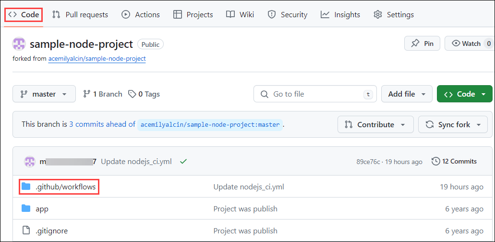

# Lab 4: Advanced Usage and Integration 

### Task 1: Utilizing advanced features like matrix builds and parallelism

Matrix builds and parallelism are advanced features in GitHub Actions that allow you to run multiple jobs concurrently.

Matrix builds let you test your code across multiple environments by creating a job matrix. This is a set of keys and values that create a combination of conditions and run a job for each one.

Parallelism allows you to run jobs or steps concurrently, reducing the total execution time.

1. Navigate to the **Code** **(1)** and click on **.github/workflows** **(2)** folder.

    

2. In the **.github/workflows** folder, select **nodejs_ci.yml** **(1)** and click on **edit** **(2)**.

    

3. Replace the following code with the below code.

```
name: Node.js CI

env:
  OUTPUT_PATH: ${{ github.workspace }}

on:
  push:
    branches:
      - master
      - dev

jobs:
  build:
    runs-on: ubuntu-latest

    strategy:
      matrix:
        node-version: [18.x]

    steps:
      - uses: actions/checkout@v3

      - name: Cache Node.js dependencies
        uses: actions/cache@v2
        with:
          path: ~/.npm
          key: ${{ runner.os }}-node-${{ matrix.node-version }}-${{ hashFiles('${{ env.OUTPUT_PATH }}/package-lock.json') }}
          restore-keys: |
            ${{ runner.os }}-node-${{ matrix.node-version }}-

      - name: Use Node.js ${{ matrix.node-version }}
        uses: actions/setup-node@v3
        with:
          node-version: ${{ matrix.node-version }}
```

4. In the pop up windows of **Commit Changes** click on the **Commit changes**.

    

5. Click on **Action** **(1)**, verify the workflow has been executed successfully once the workflow is succedded select the newly created workflow **Create nodejs_ci.yml** **(2)**.

    

    > Feel free to go through the workflow

### Task 2: Integrating with GitHub features issue tracking

GitHub Actions can be integrated with GitHub's issue tracking to automate certain workflows. For instance, you can set up a workflow to automatically respond to new issues, label issues based on their content, or even close stale issues.

```
name: Issue Response

on:
  issues:
    types: [opened]

jobs:
  respond:
    runs-on: ubuntu-latest
    steps:
    - name: Respond to issue
      uses: actions/github-script@v3
      with:
        github-token: ${{secrets.GITHUB_TOKEN}}
        script: |
          const issueComment = `Thank you for opening an issue. We will get back to you soon!`;
          github.issues.createComment({
            issue_number: context.issue.number,
            owner: context.repo.owner,
            repo: context.repo.repo,
            body: issueComment
          });
```


### Task 3: Setting up a matrix build to test across different operating systems and versions