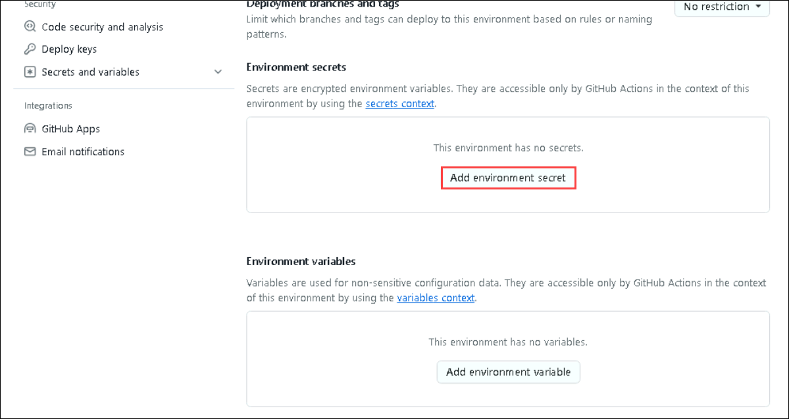
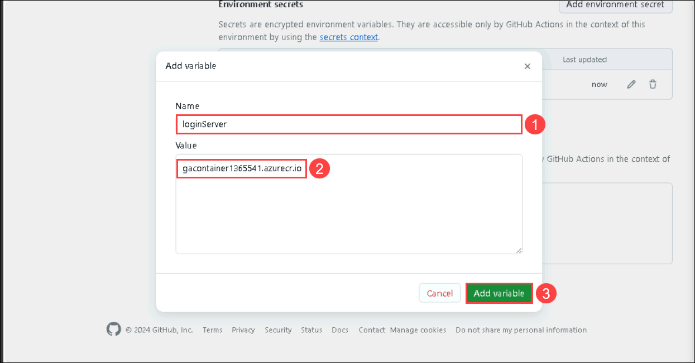
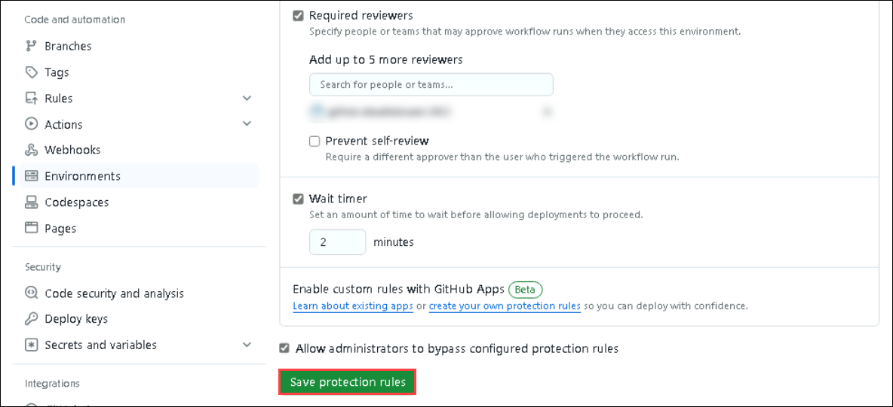
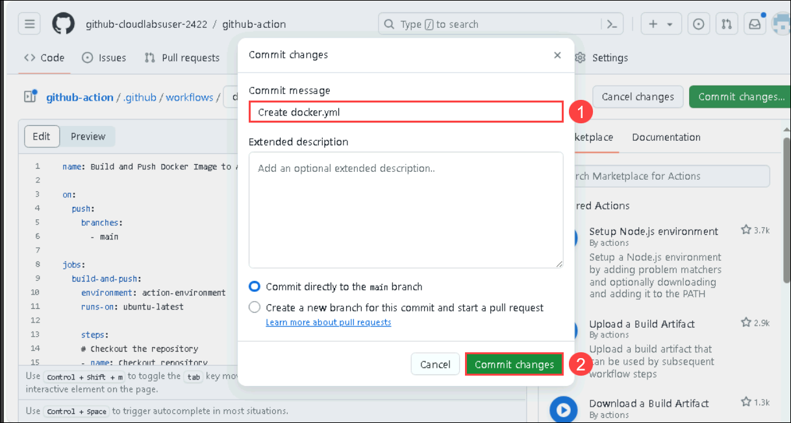
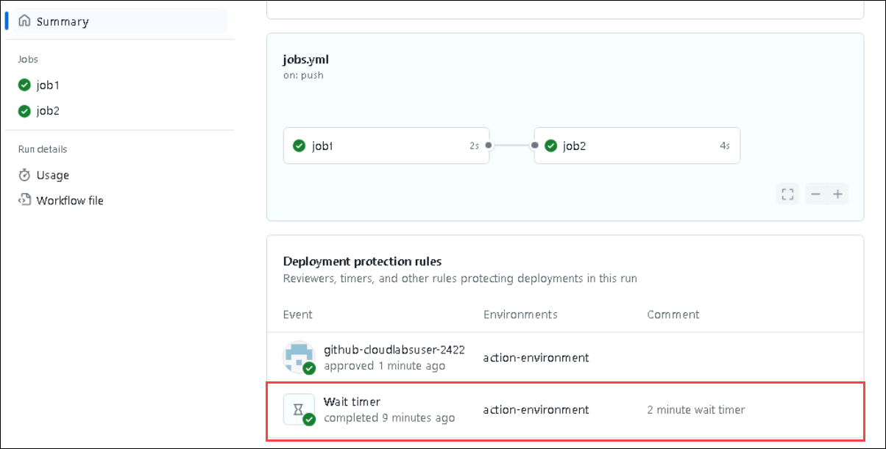

# Lab 4: GitHub Environment

In this exercise, You'll learn how to set up environments with protection rules, wait timers, environment secrets and vairables. A workflow job that references an environment must adhere to these protection rules before it can run or access the environment's secrets.

## Task 1: Set up Environment

1. From GitHub, navigate to **Settings (1)** tab, select **Envrionments (2)**, and click on **New Environment (3)**.

    

1. Follow the below steps and create the enviornment. 

**Required Reviewers**
   - Provide name as **action environment** and click on **configure environment**.

   - In the Deployment protection rules section, check **Required reviewers** option, search the GitHub username and add the user. You can find the username in the GitHub homepage.

**Wait Timer**
   - Enable **Wait timer** option and set it to 2 minutes.
     

   - Now, scroll down to **Environment Secrets** and click on **Add environment secret**.
     

   **Environment Secrets**

   - Navigate to **Environment Details** **(1)**, click on **Service Principal Details** **(2)** and copy the **Subscription ID**, **Tenant Id (Directory ID)**, **Application Id(Client Id)** and **Secret Key (Client Secret)**.

     
   
   - Replace the values that you copied in below Json. You will be using them in this step.
   
      ```json
      {
        "clientSecret": "******",
        "subscriptionId": "******",
        "tenantId": "******",
        "clientId": "******"
      }
      ```

   - Under Actions Secrets/New secret page, enter the below mentioned details and Click on Add secret (3).

   - Name : Enter **AZURE_CREDENTIALS** (1)
   - Value : Paste the service principal details in json format (2)

     

**Environment Variable**

   - Navigate to **Azure portal** and select your container instance **gacontainer<inject key="DeploymentID" enableCopy="false"/>** which you deployed in earlier exercise.

   - Click on **Access Keys** **(1)** on the left pane under the **Settings** tab and copy the **Registry Name** **(2)** and **Login server** **(3)** into a notepad.

     

   - Navigate back to GitHub, Under **Environment variable** section, click on **Add environment variable**.
   
     

   - Provide name as **registryName (1)**,paste the **value** which you copied from in earlier steps, and click on **Add Variable**.

     

   - Similarly, click again on **Add environment variable**.

     

   - Click on **Save protection rules** and save the environment.
   

**Creating Workflow with Environment**

1. From GitHub home page, navigate to `.github/workflows/jobs.yml` file and update the script as below.

    ```
    name: Build and Push Docker Image to ACR
    
    on:
      push:
        branches:
          - main
    
    jobs:
      build-and-push:
        environment: action-environment
        runs-on: ubuntu-latest
    
        steps:
        # Checkout the repository
        - name: Checkout repository
          uses: actions/checkout@v2
    
        # Log in to Azure
        - name: Log in to Azure CLI
          uses: azure/login@v1
          with:
            creds: ${{ secrets.AZURE_CREDENTIALS }}
    
        # List files in the current directory
        - name: List files
          run: ls -la
    
        # Build Docker image
        - name: Build Docker image
          env: 
            LOGIN_SERVER: ${{ vars.LOGIN_SERVER }}
          run: |
            docker buildx build . -t $LOGIN_SERVER/my-app:latest
    
        # Log in to Azure Container Registry
        - name: Log in to Azure Container Registry
          env:
            REGISTRY_NAME: ${{ vars.REGISTRY_NAME }}
          run: |
            az acr login --name $REGISTRY_NAME
    
        # Push Docker image to Azure Container Registry
        - name: Push Docker image
          env:
            LOGIN_SERVER: ${{ vars.LOGIN_SERVER }}
          run: |
            docker push $LOGIN_SERVER/my-app:latest
    ```

   

1. Once you have updated the workflow file, commit the changes.

   

1. Navigate to Actions tab and select the **update jobs.yml** action.

   

1. You'll be able to see a request for approval as the github username was added in the previous steps. Click on **Review deployments**.

   

1. In the Review pending deployments pop window, select the **action-environment** and click on **Approve and deploy**.

   

1. You will also be able to see the **wait timer** status that job1 waited for 2 minutes before starting the execution.

   

1. You can also notice the environment variables and secret values defined the Environment are fetched and are used in the execution.

In this exercise, you set up GitHub Environment and verified using Reviewer account, Wait timer. Environment variables, and secrets.

