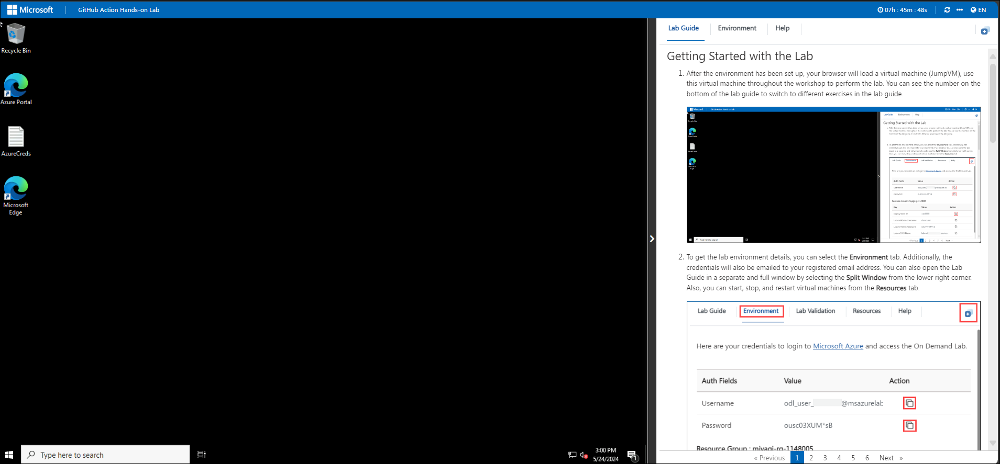
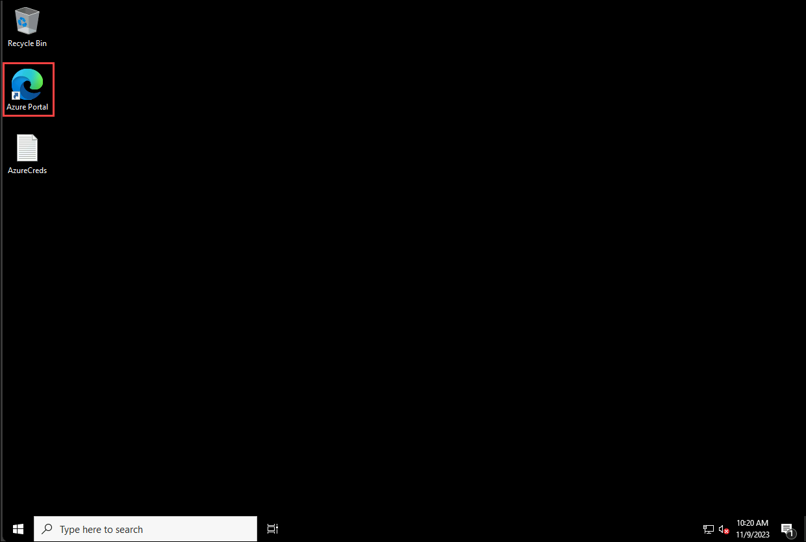
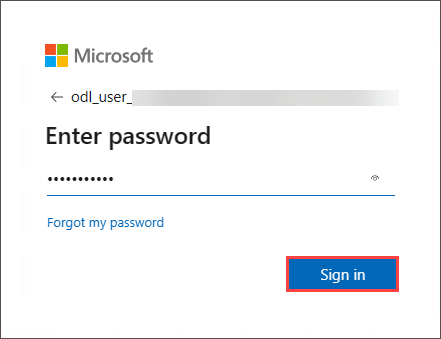
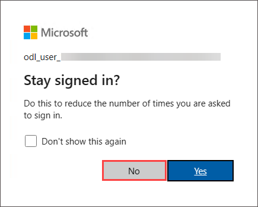
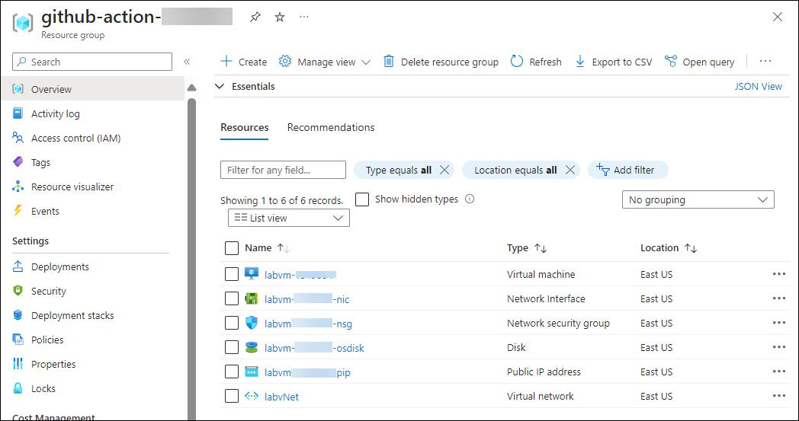

# Advanced Workflow Automation with GitHub Actions

### Overall Estimated Duration: 8 Hours
## Overview

This hands-on lab provides a comprehensive introduction to GitHub Actions, guiding you through essential workflow automation techniques. It covers workflow setup, including triggers, jobs, and CI workflows, followed by action integration using both pre-built and custom actions. Participants will explore GitHub Environments for managing deployment stages securely and dive into advanced workflows focusing on secure coding, CI/CD, and best practices. The lab also introduces OpenID Connect (OIDC) for secure Azure integration and demonstrates GitHub-Azure DevOps integration to streamline project management, automate work item tracking, and enhance collaboration.

## Objectives

- **Getting Started with GitHub (Optional: Read-Only)**
- **Workflow Setup**
- **Action Integration**
- **Advanced Workflows**
- **GitHub Environment**
- **Security and Best Practices**
- **Integrating with Azure DevOps**

## Prerequisites

- Basic GitHub Knowledge
- Fundamentals of CI/CD
- Version Control Concepts

## Getting Started with the Lab

1. After the environment has been set up, your browser will load a virtual machine (JumpVM). Use this virtual machine throughout the workshop to perform the lab. You can see the number on the bottom of the lab guide to switch to different exercises in the lab guide.

   
 
1. To get the lab environment details, click on the **Environment** tab. Additionally, the credentials will also be emailed to your registered email address. You can open the Lab Guide in a separate and full window by selecting the **Split Window** option from the lower right corner. Also, you can start, stop, and restart virtual machines from the **Resources** tab.

    
   
   > Check out the **SUFFIX** value on the **Environment** tab. Use it wherever you see **SUFFIX** or **DeploymentID** in lab steps.
 
## Login to the Azure Portal

1. In the **JumpVM**, click on the **Azure portal shortcut** of the Microsoft Edge browser, which is created on the desktop.

   

1. On the **Sign in to Microsoft Azure** tab, you will see the login screen. Enter the email or username, and click on **Next**. 

   * **Email/Username**: **<inject key="AzureAdUserEmail"></inject>**

     
     
1. Now enter the password and click on **Sign in**.
   
   * **Password**: **<inject key="AzureAdUserPassword"></inject>**

     
   
1. If you see the pop-up **"Stay Signed in?"** Select **No**.

   

1. If a **Welcome to Microsoft Azure** pop-up window appears, select **Cancel** to skip the tour.

    
   
1. Now that you are able to see the **Azure Portal Dashboard**, click on the **Resource groups** option from the **Navigate panel** to check out the available resource groups.

   .png)

1. In the **Resource groups** section, click on the **github-action-xxxx<inject key="DeploymentID" enableCopy="false"/>** resource group.

   

1. Once redirected to the **github-action-xxxx<inject key="DeploymentID" enableCopy="false"/>** resource group, verify the resources present in it.

   

## Support Contact
The CloudLabs support team is available 24/7, 365 days a year, via email and live chat to ensure seamless assistance at any time. We offer dedicated support channels tailored specifically for both learners and instructors, ensuring that all your needs are promptly and efficiently addressed.

Learner Support Contacts:

   - Email Support: cloudlabs-support@spektrasystems.com
   - Live Chat Support: https://cloudlabs.ai/labs-support

Now you're all set to explore the powerful world of technology. Feel free to reach out if you have any questions along the way. Enjoy your workshop!

Now, click on **Next** from the lower right corner to move on to the next page.

  

## Happy Learning!!
