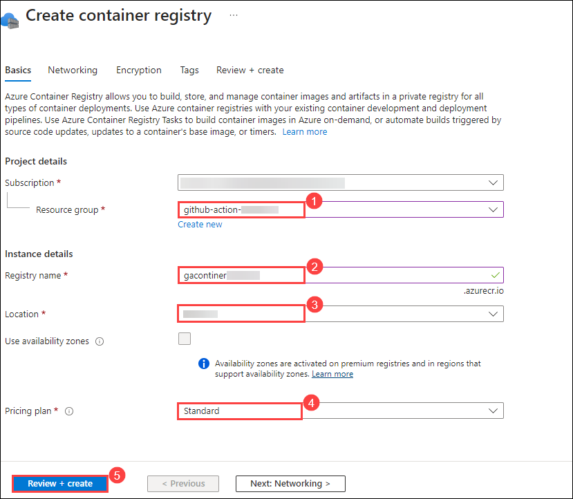
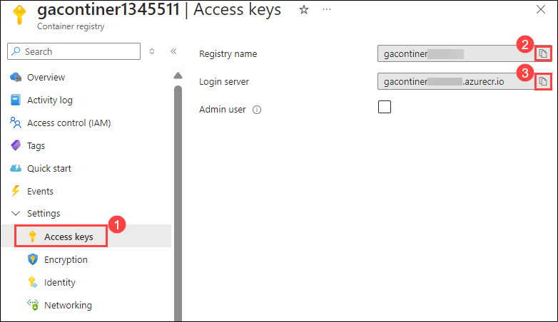
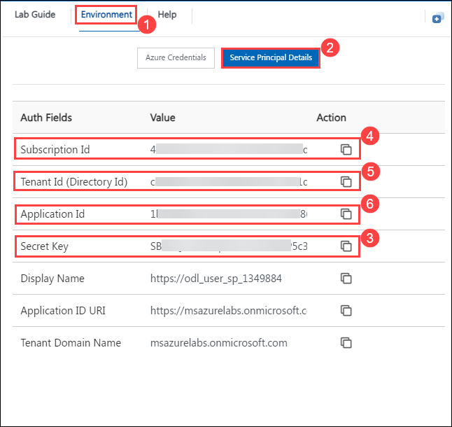
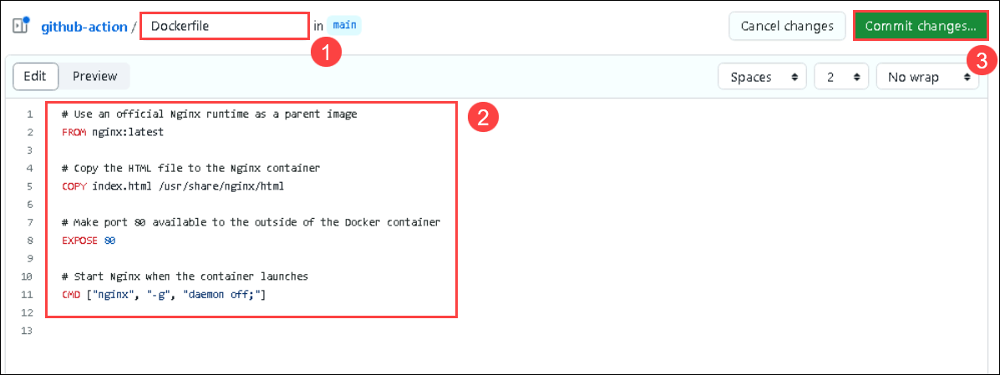
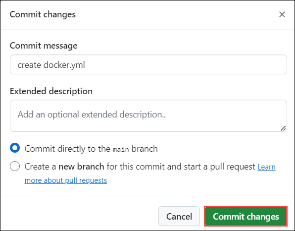
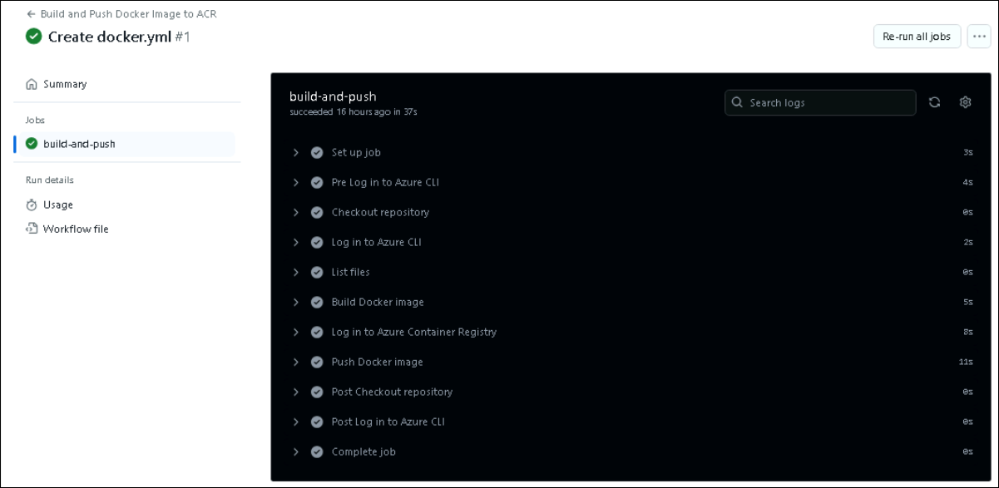
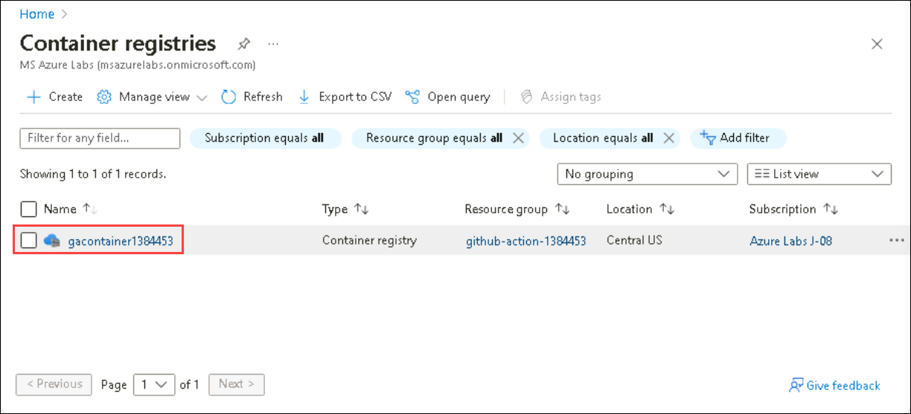
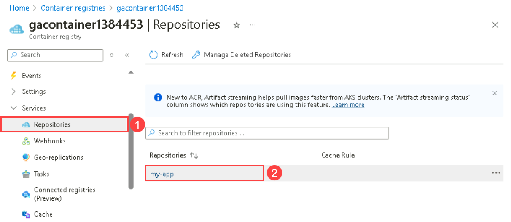
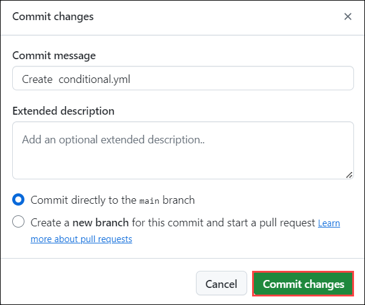
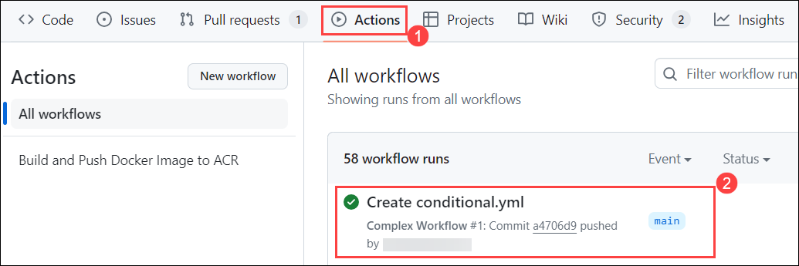

# Lab 2: Action Integration

## Overview

Integrating Azure with GitHub Actions provides a seamless and efficient way to automate your workflows and deploy applications directly to Azure from your GitHub repository. GitHub Actions, a powerful automation tool, enables continuous integration and continuous deployment (CI/CD) pipelines, allowing you to build, test, and deploy your code with ease.

   > **Note**: For the purpose of this demo, we are using the main branch directly. However, it is important to follow best practices in a production environment by not committing changes directly to the main branch.

## Lab Objectives

- Task 1: Using GitHub Actions with Azure Container Registries with Secret Variables in Workflows
- Task 2: Conditional Execution Using If Expressions

### Task 1: Using GitHub Actions with Azure Container Registries with Secret Variables in Workflows 

Securing sensitive data like API keys and credentials is crucial to protecting your workflows and preventing unauthorized access. This can be achieved by using secrets, which are encrypted variables that can be securely used in your workflows without exposing the actual values. In this task, you'll create an action to build and push a Docker image to the Azure container registry.

1. Navigate to `potal.azure.com`. In the search bar, search for **Container registries** **(1)** and select **Container registries** **(2)**.

   .png)

1. In the **Container registries** tab, click on the **+ Create** button.

   

1. Under the **basics** tab, add the following details:

    - **Subscription**: Select the default subscription.
    - **Resource Group**: Select **github-action-<inject key="DeploymentID" enableCopy="false"/>** **(1)**
    - **Registry Name**: Enter **gacontainer<inject key="DeploymentID" enableCopy="false"/>** **(2)**
    - **Location**: Select the default **location.** **(3)**
    - **Pricing Plan**: Choose **Standard** **(4)**
    -  Click on the **Review + create** **(5)** option.

       
   
1. Click on **Create**.

   

1. Once the deployment is complete, click on **Go to resource**.

   

1. Navigate to **Access Keys** **(1)** on the left pane under the **Settings** tab and copy the **Registry name** **(2)** and **Login server** **(3)** into a notepad.

   

1. Navigate back to the `GitHub-action` repo from the GitHub repository, and select the **Settings** tab from the lab files repository.

    

1. Under **Security**, expand **Secrets and variables** **(1)** by clicking on the drop-down arrow. Continue by selecting the **Actions** **(2)** option from the left navigation bar.

   

1. Click on the **New repository secret** option in the **Repository secrets** window.

    .png)

1. Copy and paste the code in the secret.
   
      ```json
      {
        "clientSecret": "******",
        "subscriptionId": "******",
        "tenantId": "******",
        "clientId": "******"
      }
      ```
1. Navigate to the **Environment** **(1)** tab, click on the **Service Principal Details** **(2)** option, and copy the **Subscription ID (4)**, **Tenant Id (Directory ID) (5)**, **Application Id (Client Id) (6),** and **Secret Key (Client Secret) (3)**.

   

1. Under the **Actions secrets/New secret** page, enter the below-mentioned details and click on **Add secret (3)**.

   - Name: Enter **AZURE_CREDENTIALS** **(1)**

   - Value: Paste the service principal details in JSON format. **(2)**

     
   
1. Navigate to the **Code** **(1)** tab, click on **Add file** **(2)**, and then select the **+ Create new file** **(3)** option.
    
    
    
1. Provide the file name as **Dockerfile (1)**. In the editor, **copy and paste (2)** the script below, then click on **Commit changes (3)**.

   >**Note**: Please make sure to name the file as **Dockerfile** only, as it is a standard convention used by Docker and widely followed in the Docker community.

    ```
    # Use an official Nginx runtime as a parent image
    FROM nginx:latest

    # Copy the HTML file to the Nginx container
    COPY index.html /usr/share/nginx/html

    # Make port 80 available to the outside of the Docker container
    EXPOSE 80

    # Start Nginx when the container launches
    CMD ["nginx", "-g", "daemon off;"]
    ```

    

1. In the **Commit changes** pop-up, click on the **Commit changes** button.

    .png)

    >**Note:** This Dockerfile utilizes the latest official Nginx image as its base. It copies an **index.html** file into the Nginx container's default web root directory. Port 80 is exposed to allow external access to the container, and the container launches Nginx with the command **nginx -g 'daemon off;'** to keep it running in the foreground.

1. Again, from the **Code** **(1)** tab in GitHub, click on **Add file** **(2)** and select the **+ Create new file** **(3)** option.
    
    

1. Provide the file name as **index.html (1)**. In the editor, **copy and paste (2)** the script below, then click on **Commit changes (3)**.

    ```
    <!DOCTYPE html>
    <html>
    <head>
        <title>GitHub Actions Workshop</title>
        <style>
            body {
                font-family: Arial, sans-serif;
                margin: 20px;
            }
            h1 {
                color: #333;
            }
            h2 {
                color: #666;
                margin-top: 30px;
            }
            p {
                margin-bottom: 20px;
            }
            ol {
                margin-left: 20px;
            }
        </style>
    </head>
    <body>
        <h1>GitHub Actions Workshop</h1>
        <p>Welcome to the GitHub Actions Workshop! This workshop is designed to help you understand and implement GitHub Actions effectively in your projects. Whether you're new to GitHub Actions or looking to enhance your existing knowledge, this workshop covers a range of topics to get you started and take your workflows to the next level.</p>

        <h2>Table of Contents</h2>
        <ol>
            <li><a href="#workflow-setup">Workflow Setup</a></li>
            <li><a href="#action-integration">Action Integration</a></li>
            <li><a href="#best-practices-and-security">Best Practices and Security</a></li>
            <li><a href="#advanced-usage-and-integration">Advanced Usage and Integration</a></li>
        </ol>

        <h2 id="workflow-setup">Workflow Setup</h2>
        <p>In this module 1, you'll learn the fundamentals of GitHub Actions and workflow files. We'll cover how to trigger workflows with events like pushes and pull requests, define jobs and steps within workflows, and set up a basic CI workflow for testing code on every push.</p>

        <h2 id="action-integration">Action Integration</h2>
        <p> Module 2 focuses on incorporating pre-built actions from the GitHub Marketplace and creating custom actions for reusable tasks. You'll learn how to leverage third-party actions to streamline your workflows, with a practical example of deploying a Docker container to a cloud platform.</p>

        <h2 id="best-practices-and-security">Best Practices and Security</h2>
        <p>In Module 3, we'll discuss guidelines for writing efficient and maintainable workflows, as well as securing sensitive data like API keys and credentials. You'll explore examples of optimizing workflow performance by caching dependencies to ensure smooth operations.</p>

        <h2 id="advanced-usage-and-integration">Advanced Usage and Integration</h2>
        <p>Module 4 dives into advanced features of GitHub Actions, including matrix builds and parallelism. You'll also learn how to integrate with GitHub features such as pull requests and issue tracking, with a hands-on example of setting up a matrix build to test across different operating systems and versions.</p>
    </body>
    </html>
    ```

    .png)

1. In the **Commit changes** pop-up, click on the **Commit changes** button.

    .png)

1. From the GitHub **Code** **(1)** tab, navigate to the **.github/workflows** **(2)** folder.

    

1. In the **.github/workflows** folder, click on **Add file** **(1)**, and click on **+ Create new file** **(2)**.

    

1. In the editor, update the code with the below-provided code, replace **{Login_server}** from lines 40 and 50 with **Azure Container registry Login server**, and replace **{Registry name}** from line 45 with **Azure Container registry Registry name**.

   >**Note**: Paste the value you copied in **Task 1, Step 6,** for the **Login_server** and **Registry name.**

    ```
    # This is the configuration for our GitHub Actions workflow to build and push a Docker image to Azure Container Registry (ACR).
    # The workflow is triggered on push events targeting the main branch.
    name: Build and Push Docker Image to ACR

    on:
      push:
        branches:
          - main
        paths:
          - '.github/workflows/docker.yml'
      pull_request:
        branches:
          - main
        paths:
          - '.github/workflows/docker.yml'
      workflow_dispatch:

    jobs:
      build-and-push:
        runs-on: ubuntu-latest

        steps:
        # Step to checkout the repository
        - name: Checkout repository
          uses: actions/checkout@v2

        # Step to log in to Azure using the Azure CLI GitHub Action
        - name: Log in to Azure CLI
          uses: azure/login@v1
          with:
            creds: ${{ secrets.AZURE_CREDENTIALS }}

        # Step to list files in the current directory
        - name: List files
          run: ls -la

        # Step to build the Docker image
        - name: Build Docker image
          run: |
            docker buildx build . -t {Login_server}/my-app:latest

        # Step to log in to Azure Container Registry
        - name: Log in to Azure Container Registry
          run: |
            az acr login --name {Registry name}

        # Step to push the Docker image to Azure Container Registry
        - name: Push Docker image
          run: |
            docker push {Login_server}/my-app:latest  
    ```

    .png)

1. Provide the file name as **docker.yml (1)**. In the editor, **review(2)** the script present, then click on **Commit changes (3).**

   .png)
   
1. In the **Commit changes** pop-up window, click on the **Commit changes** option.

    

1. Click on **Actions**, select the **Create docker.yml** action, and verify the workflow has been executed successfully.

   

   >**Note:** This GitHub Actions workflow, named "Build and Push Docker Image to ACR," automates the process of building and pushing a Docker image to Azure Container Registry (ACR) when triggered by pushes or pull requests to the main branch, or manually **(`workflow_dispatch`)**. It runs on an Ubuntu environment and includes steps to checkout the repository, authenticate with Azure using stored credentials, list files, build a Docker image tagged as **`{Login_server}/my-app:latest`**, log in to the Azure Container Registry, and finally push the built Docker image to the registry.

1. Once the execution is complete, navigate to `potal.azure.com`. In the search bar, search for **Container registries** **(1)** and select **Container registries** **(2)**.

   .png)

1. Select **gacontainer<inject key="DeploymentID" enableCopy="false"/>** from the list.

   

1. Select **Repositories (1)** from **Services**, and you should be able to see an image named **my-app (2)**. This confirms that the image was pushed using **GitHub Actions**.

   

1. In the **my-app** repository, you'll be able to see the image version, the last modified details, and much more.

   

>**Congratulations** on completing the Task! Now, it's time to validate it. Here are the steps:
> - Hit the Validate button for the corresponding task. If you receive a success message, you have successfully validated the lab. 
> - If not, carefully read the error message and retry the step, following the instructions in the lab guide.
> - If you need any assistance, please contact us at cloudlabs-support@spektrasystems.com.

   <validation step="b17d43b4-847b-47fe-ad7f-eddb23f058e6" />

### Task 2: Conditional Execution Using If Expressions

One of the key features that make GitHub Actions flexible and robust is the ability to conditionally execute steps within your workflows using if expressions. Conditional execution is essential when you want certain steps to run only under specific conditions, such as based on the branch name, the outcome of a previous step, or custom environment variables. This helps in creating more efficient and context-aware CI/CD pipelines, reducing unnecessary executions, and ensuring that the right actions are taken in the right scenarios.

1. Navigate to the **GitHub** homepage. From the  **Code** **(1)** tab, click on the **.github/workflows** **(2)** folder.

   

1. In the **.github/workflows** folder, click on **Add files** **(1)**, and select **+ Create new file** **(2)**.

   

1. Provide the file name as **conditional.yml (1)**. In the editor, **copy and paste (2)** the script below, then click on **Commit changes (3).**

    ```
    # This is the configuration for our GitHub Actions workflow named "Complex Workflow".
    # The workflow is triggered on both push and pull request events.
    name: Complex Workflow

    on:
     push:
       branches:
         - main
       paths:
         - '.github/workflows/conditional.yml'
     pull_request:
       branches:
         - main
       paths:
         - '.github/workflows/conditional.yml'
     workflow_dispatch:

    jobs:
      # Job 1 runs on an Ubuntu machine
      job1:
        runs-on: ubuntu-latest
        steps:
        # Step to checkout the repository
        - name: Checkout
          uses: actions/checkout@v2
        # Step to run a one-line script
        - name: Run a one-line script
          run: echo Hello, world!

      # Job 2 depends on the successful completion of Job 1
      job2:
        needs: job1
        runs-on: ubuntu-latest
        # Job 2 only runs on push events and if Job 1 was successful
        if: github.event_name == 'push' && success()
        steps:
        # Step to checkout the repository
        - name: Checkout
          uses: actions/checkout@v2
        # Step to run a different one-line script
        - name: Run a different one-line script
          run: echo Hello again, world!
    ```

    .png)

1. In the **Commit changes** pop-up, click on the **Commit changes** button.

    

1. Click on **Actions** **(1)** and verify that the workflow has been executed successfully by spotting the green badge. Moving on, select the newly created workflow **Create conditional.yml** **(2)**.

    
   
   >**Note**: This GitHub Actions workflow, named "Complex Workflow," triggers push and pull request events to the main branch when the .github/workflows/conditional.yml file is modified. It includes two jobs: job1, which checks out the repository and runs a simple script, and job2, which runs only if job1 is successful and the event is a push, checking out the repository again and running a different script.

>**Congratulations** on completing the Task! Now, it's time to validate it. Here are the steps:
> - Hit the Validate button for the corresponding task. If you receive a success message, you have successfully validated the lab. 
> - If not, carefully read the error message and retry the step, following the instructions in the lab guide.
> - If you need any assistance, please contact us at cloudlabs-support@spektrasystems.com.

   <validation step="09dbbb26-404c-4db2-a0d5-0db89167eb42" />

### Summary

In this lab, you've learned about integrating Azure with GitHub Actions and using "if expressions" in GitHub Actions.

### You have successfully completed the lab
