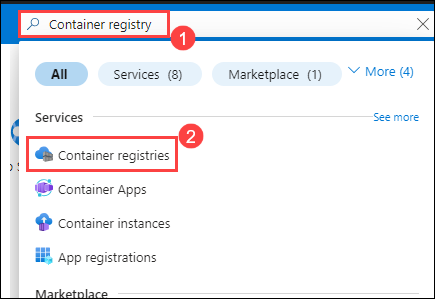
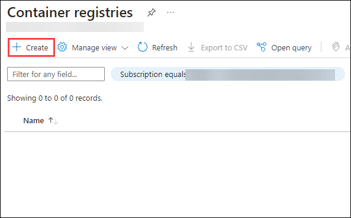
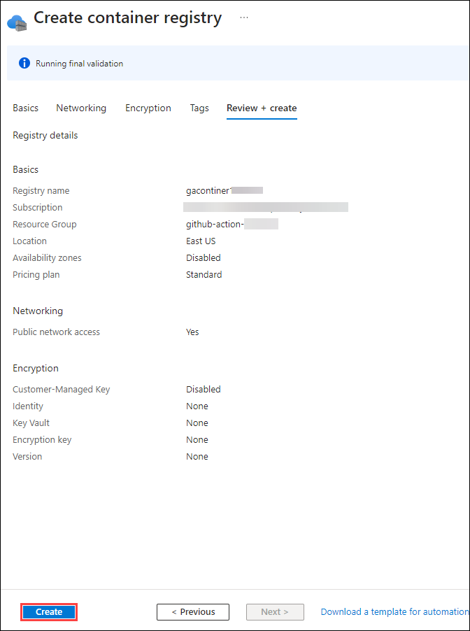
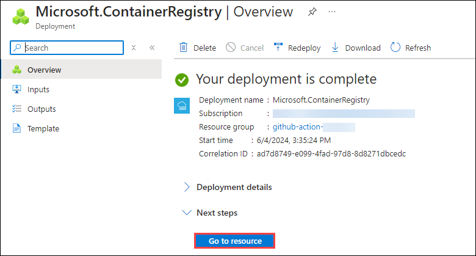
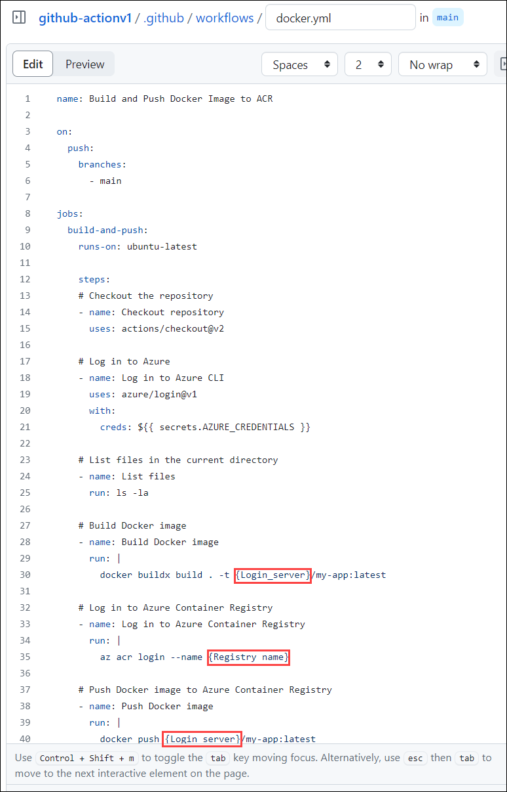

# Lab 2: Action Integration

### Task 1: Using GitHub Actions with Azure container registries with Secrets Variables in Workflows 

Securing sensitive data like API keys and credentials is crucial to protect your workflows and prevent unauthorized access. This can be achieved by using secrets, which are encrypted variables that can be securely used in your workflows without exposing the actual values.

1. Navigate to `potal.azure.com`, in the search bar search for **Container registries** **(1)** and select **Container registries** **(2)**.

   

1. In the Container registries tab click on **+ Create** button.

   

1. On the **basics** tab, add the following details:

    - **Subscription**: Select the default subscription
    - **Resource Group**: Select **github-action-<inject key="DeploymentID" enableCopy="false"/>** **(1)**
    - **Registry Name**: Add **gacontainer<inject key="DeploymentID" enableCopy="false"/>** **(2)**
    - **Location**: Select the default **location** **(3)**
    - **Pricing Plan**: Choose **Standard** **(4)**
    -  Click on **Review + Create** **(5)**

      
   
1. Click on **Create**.

   

1. Once the deployment is complete, click on **Go to Resource**.

   

1. Navigate to **Access Keys** **(1)** on the left pane under the **Settings** tab and copy the **Registry Name** **(2)** and **Login server** **(3)** into a notepad.

   

1. Navigate back to the `github-action` repo, from the GitHub repository, and select the **Settings** tab from the lab files repository.

    

1. Under **Security**, expand **Secrets and variables** **(1)** by clicking the drop-down and select **Actions** **(2)** blade from the left navigation bar.

   

1. Under **Actions Secrets/New secret page**, enter the below mentioned details and Click on **Add secret** **(3)**.

   

1. Navigate to **Environment Details** **(1)**, click on **Service Principal Details** **(2)** and copy the **Subscription ID**, **Tenant Id (Directory ID)**, **Application Id(Client Id)** and **Secret Key (Client Secret)**.

   
   
   - Replace the values that you copied in below Json. You will be using them in this step.
   
      ```json
      {
        "clientSecret": "******",
        "subscriptionId": "******",
        "tenantId": "******",
        "clientId": "******"
      }
      ```

1. Under Actions Secrets/New secret page, enter the below mentioned details and Click on Add secret (3).

   - Name : Enter **AZURE_CREDENTIALS** (1)
   - Value : Paste the service principal details in json format (2)

     

1. Navigate to the **Code** **(1)**, click on **Add File** **(2)** and click on **+ Create new file** **(3)**.
    
    
    
1. Provider file name as **Dockerfile** **(1)**, in the editor **copy and paste** **(2)** the below script, and click in **commit changes** **(3)**.

    ```
    # Use an official Nginx runtime as a parent image
    FROM nginx:latest

    # Copy the HTML file to the Nginx container
    COPY index.html /usr/share/nginx/html

    # Make port 80 available to the outside of the Docker container
    EXPOSE 80

    # Start Nginx when the container launches
    CMD ["nginx", "-g", "daemon off;"]
    ```

    

1. In the **Commit changes** pop-up, click on **Commit changes** button.

    

1. Now let's create a workflow to publish into Docker Hub using GitHub action. Navigate to the **Code** **(1)**, click on **Add File** **(2)** and click on **+ Create new file** **(3)**.
    
    

1. Provider file name as **index.html** **(1)**, in the editor **copy and paste** **(2)** the below script, and click in **commit changes** **(3)**.

    ```
    <!DOCTYPE html>
    <html>
    <head>
        <title>GitHub Actions Workshop</title>
        <style>
            body {
                font-family: Arial, sans-serif;
                margin: 20px;
            }
            h1 {
                color: #333;
            }
            h2 {
                color: #666;
                margin-top: 30px;
            }
            p {
                margin-bottom: 20px;
            }
            ol {
                margin-left: 20px;
            }
        </style>
    </head>
    <body>
        <h1>GitHub Actions Workshop</h1>
        <p>Welcome to the GitHub Actions Workshop! This workshop is designed to help you understand and implement GitHub Actions effectively in your projects. Whether you're new to GitHub Actions or looking to enhance your existing knowledge, this workshop covers a range of topics to get you started and take your workflows to the next level.</p>

        <h2>Table of Contents</h2>
        <ol>
            <li><a href="#workflow-setup">Workflow Setup</a></li>
            <li><a href="#action-integration">Action Integration</a></li>
            <li><a href="#best-practices-and-security">Best Practices and Security</a></li>
            <li><a href="#advanced-usage-and-integration">Advanced Usage and Integration</a></li>
        </ol>

        <h2 id="workflow-setup">Workflow Setup</h2>
        <p>In this module 1, you'll learn the fundamentals of GitHub Actions and workflow files. We'll cover how to trigger workflows with events like pushes and pull requests, define jobs and steps within workflows, and set up a basic CI workflow for testing code on every push.</p>

        <h2 id="action-integration">Action Integration</h2>
        <p>In Module 2 focuses on incorporating pre-built actions from the GitHub Marketplace and creating custom actions for reusable tasks. You'll learn how to leverage third-party actions to streamline your workflows, with a practical example of deploying a Docker container to a cloud platform.</p>

        <h2 id="best-practices-and-security">Best Practices and Security</h2>
        <p>In Module 3, we'll discuss guidelines for writing efficient and maintainable workflows, as well as securing sensitive data like API keys and credentials. You'll explore examples of optimizing workflow performance by caching dependencies to ensure smooth operations.</p>

        <h2 id="advanced-usage-and-integration">Advanced Usage and Integration</h2>
        <p>Module 4 dives into advanced features of GitHub Actions, including matrix builds and parallelism. You'll also learn how to integrate with GitHub features such as pull requests and issue tracking, with a hands-on example of setting up a matrix build to test across different operating systems and versions.</p>
    </body>
    </html>
    ```

    

1. In the **Commit changes** pop-up, click on **Commit changes** button.

    

1. Navigate to the **Code** **(1)** and click on **.github/workflows** **(2)** folder.

    

1. In the **.github/workflows** folder, click on **Add files** **(1)**, and click on **+ Create new file** **(2)**.

    

1. In the editor update the code with the below-provided code, replace **{Login_server}** from line 30 and 40 with **Azure Container registry Login server**, and replace **{Registry name}** from line number **Azure Container registry Registry name**.

    ```
    name: Build and Push Docker Image to ACR
    
    on:
      push:
        branches:
          - main
    
    jobs:
      build-and-push:
        runs-on: ubuntu-latest
    
        steps:
        # Checkout the repository
        - name: Checkout repository
          uses: actions/checkout@v2
    
        # Log in to Azure
        - name: Log in to Azure CLI
          uses: azure/login@v1
          with:
            creds: ${{ secrets.AZURE_CREDENTIALS }}
    
        # List files in the current directory
        - name: List files
          run: ls -la
    
        # Build Docker image
        - name: Build Docker image
          run: |
            docker buildx build . -t {Login_server}/my-app:latest
    
        # Log in to Azure Container Registry
        - name: Log in to Azure Container Registry
          run: |
            az acr login --name {Registry name}
    
        # Push Docker image to Azure Container Registry
        - name: Push Docker image
          run: |
            docker push {Login_server}/my-app:latest
    ```

    

1. Provide the file name as **docker.yml** **(1)**, in the editor **copy and paste** **(2)** the below script, and click on **commit changes** **(3)**.

   
   
1. In the pop up window of **Commit Changes** click on the **Commit changes**.

    

1. Click on **Action** **(1)**, verify the workflow has been executed successfully once the workflow is succedded select the newly created workflow **updated docker.yml** **(2)**.

1. Navigate back to `potal.azure.com`, in the search bar search for **Container registries** **(1)** and verify the container registry has been created.

1. Click on **Next** button for next Lab.
