# Lab 3: Advanced Workflows

- **Reusing workflows**: Rather than copying and pasting from one workflow to another, you can make workflows reusable. You and anyone with access to the reusable workflow can then call the reusable workflow from another workflow. Reusing workflows avoids duplication. This makes workflows easier to maintain and allows you to create new workflows more quickly by building on the work of others, just as you do with actions. Workflow reuse also promotes best practices by helping you to use workflows that are well-designed, have already been tested, and have been proven to be effective. Your organization can build up a library of reusable workflows that can be centrally maintained, for more information please go through the given link [Reusing workflows](https://docs.github.com/en/actions/using-workflows/reusing-workflows).


## Task 1: Using Reusable Workflow

1. From GitHub, navigate to the **.github/workflows** folder, click on **Add files** **(1)**, and click on **+ Create new file** **(2)**.

    

1. Copy the code given below, paste it in the window, and name the file as **reusable-print-message.yml**

   ```
   # This GitHub Actions workflow template is designed as a reusable component for printing a message.
   # It is triggered when called by another workflow using 'workflow_call', expecting a required input 'message' of type string.
   name: Reusable Print Message

   on:
     # Triggered when this workflow is called by another workflow
     workflow_call:
       inputs:
         # Defines a required input parameter 'message' of type string
         message:
           required: true
           type: string

   jobs:
     # Job named 'print-message' runs on an Ubuntu environment
     print-message:
       runs-on: ubuntu-latest

       steps:
         # Step to print the received message to the workflow log
         - name: Print message
           run: echo "Hi, this message is from primary workflow"
   ```

   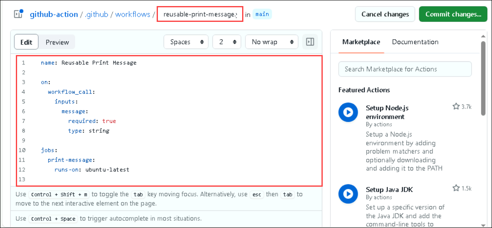

1. Click on **Commit changes (1)** button and click on **Commit changes (2)** in the pop window.

   

   > **Note:** This GitHub Actions workflow template, named "Reusable Print Message", is designed to be a reusable component triggered by another workflow using **workflow_call**. It requires a string input parameter **message**. The workflow runs a job called **print-message** on an Ubuntu environment, which includes a step to print the received message to the workflow log.

1. Again, navigate to `.github/workflows`, Click on the **Add file (2)** dropdown, and select **+ Create new file (3)**.

   

1. Copy the code given below, paste it into the window, and name the file as **caller-workflows.yml**

   ```
   name: Caller Workflow

   on:
     push:
       branches:
         - main
       paths:
         - '.github/workflows/caller-workflows.yml'
     workflow_dispatch:

   jobs:
     # Job to call the reusable workflow
     call-reusable-workflow:
       # Specifies the path to the reusable workflow
       uses: ./.github/workflows/reusable-print-message.yml
       with:
         # Passes the message to the reusable workflow
         message: "Hello from the caller workflow!"
    ```

   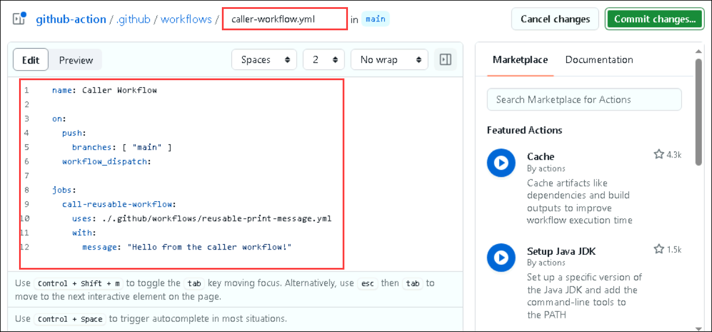   

1. Click on **Commit changes (1)** button and click on **Commit changes (2)** in the pop window.

   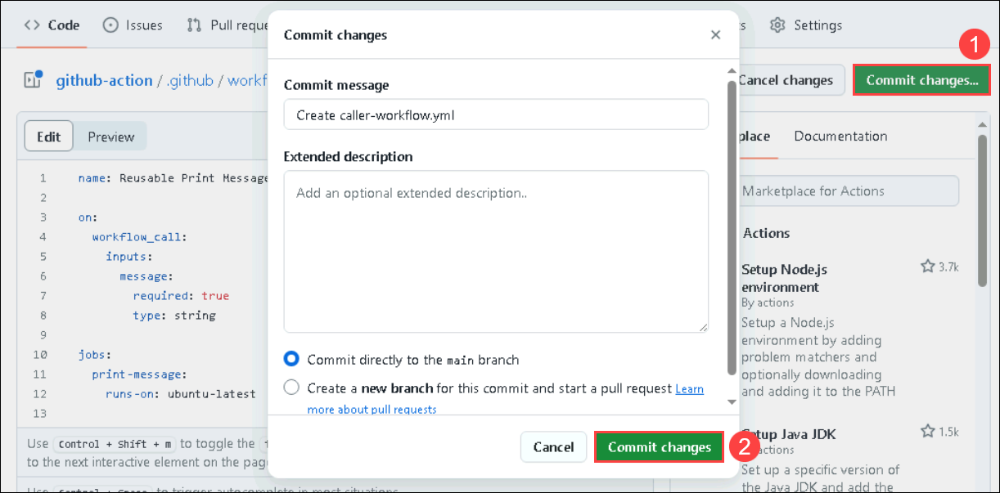

1. Now, navigate to **Actions (1)** tab and select **Create caller-workflow.yml (2)**. 

   

1. Select the **print-message (1)** job from the side-blade and **expand (2)** the same job in the output window. You'll see that the message from reusable-print-message.yml is fetched by the caller workflow. Hence, this is how the concept of reusable workflows in GitHub action works.

   

   > **Note:** This GitHub Actions workflow named "Caller Workflow" triggers on pushes to the main branch and manual dispatch for changes to the **.github/workflows/caller-workflows.yml** file. It calls a reusable workflow defined in **reusable-print-message.yml**, passing the message "Hello from the caller workflow!".

### Task 2: Explanation and usage of Matrix builds

Matrix builds and parallelism is advanced features in GitHub Actions that allow you to run multiple jobs concurrently.

Matrix builds let you test your code across multiple environments by creating a job matrix. This is a set of keys and values that create a combination of conditions and run a job for each one.

Parallelism allows you to run jobs or steps concurrently, reducing the total execution time.

1. Naviagte to the [sample-node-project](https://github.com/acemilyalcin/sample-node-project) repo and click on **Fork** **(2)**.

2. Navigate to the **Action** **(1)** directory in your repository, in `Get started with GitHub Actions` click on **Set up a workflow yourself (2)**.

    

4. Provider file name as **nodejs_ci.yml** **(1)**, in the editor **copy and paste** **(2)** the below script, and click in **commit changes** **(3)**.

    

    ```
    name: Node.js CI

    env:
      OUTPUT_PATH: ${{ github.workspace }}

    on:
      push:
        branches:
          - main
        paths:
          - '.github/workflows/nodejs_ci.yml'

    jobs:
      build:
        runs-on: ubuntu-latest

        strategy:
          matrix:
            node-version: [18.x]

        steps:
          # Step to checkout the repository
          - uses: actions/checkout@v3

          # Step to cache Node.js dependencies
          - name: Cache Node.js dependencies
            uses: actions/cache@v2
            with:
              path: ~/.npm
              key: ${{ runner.os }}-node-${{ matrix.node-version }}-${{ hashFiles('${{ env.OUTPUT_PATH }}/package-lock.json') }}
              restore-keys: |
                ${{ runner.os }}-node-${{ matrix.node-version }}-

          # Step to set up the specified version of Node.js
          - name: Use Node.js ${{ matrix.node-version }}
            uses: actions/setup-node@v3
            with:
              node-version: ${{ matrix. Node-version }}
    ```

    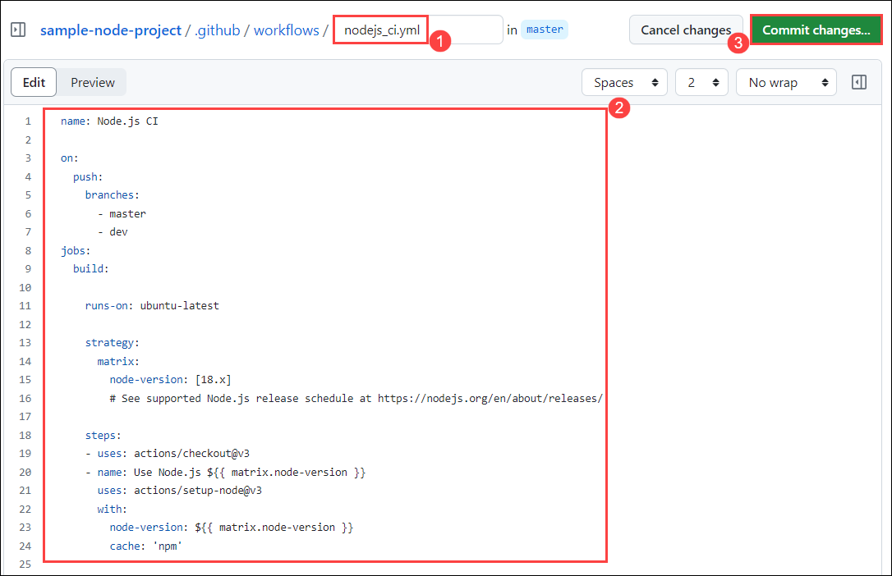

5. In the pop up windows of **Commit Changes** click on the **Commit changes**.

    

6. Click on **Actions** **(1)**, verify the workflow has been executed successfully once the workflow is succedded select the newly created workflow **Create nodejs_ci.yml** **(2)**.

    

    > Feel free to go through the workflow

### Task 3: Matrix builds for testing across multiple environments.

A matrix build is a CI/CD pipeline strategy that allows you to run tests across a variety of environments simultaneously. Each environment can vary by operating system, programming language version, dependency versions, and other factors. The matrix build configuration defines combinations of these variables, creating a grid (or matrix) of different test scenarios.

- **Comprehensive Testing**: Ensures that your software works under different configurations, reducing the risk of environment-specific bugs.
- **Parallel Execution**: Tests can run in parallel, speeding up the testing process and providing faster feedback.
- **Consistency**: Helps maintain consistent behavior across different environments, which is crucial for cross-platform applications.

1. Navigate back to the `github-action` repo, from the GitHub repository.

2. Navigate to the **Code** **(1)**, Click on **Add File** **(2)** and click on **+ Create new file** **(3)**.

3. Provider file name as **requirements.txt** (1), in the editor **copy and paste** **(2)** the below script, and click in **commit changes** **(3)**.

   ```
   pytest
   ```
   
4. In the pop-up windows of Commit Changes click on the **Commit changes** button.

5. Click on **Add File** **(2)** and click on **+ Create new file** **(3)**.   

6. Provider file name as with folder creation **tests/test_sample.py** **(1)**, in the editor **copy and paste** **(2)** the below script, and click in **Commit changes** **(3)**.

    ```
    def test_sample():
        print("Running test_sample")
        assert 1 + 1 == 2
        print("Completed test_sample successfully")
    ```

7. In the pop-up windows of Commit Changes click on the **Commit changes** button.

8. Navigate to the **Code** **(1)** and click on **.github/workflows** **(2)** folder.

   

9. In the **.github/workflows** folder, click on **Add files** **(1)**, and click on **+ Create new file** **(2)**.

      

10. Provider file name as **matrix.yml** **(1)**, in the editor **copy and paste** **(2)** the below script, and click in **commit changes** **(3)**.

    ```
    name: CI
    
    on:
      push:
        branches:
          - main
      pull_request:
        branches:
          - main
    
    jobs:
      build:
        runs-on: ubuntu-latest
        
        strategy:
          matrix:
            python-version: [3.12]
            os: [ubuntu-latest, windows-latest, macos-latest]
    
        environment: action-environment
    
        steps:
          - name: Checkout repository
            uses: actions/checkout@v2
    
          - name: Set up Python ${{ matrix.python-version }}
            uses: actions/setup-python@v2
            with:
              python-version: ${{ matrix.python-version }}
    
          - name: Install dependencies
            run: |
              python -m pip install --upgrade pip
              pip install -r requirements.txt
    
          - name: Run tests
            run: |
              pytest
    ```

    > **Note**: This CI configuration uses GitHub Actions to run tests on multiple OS (Ubuntu, Windows, macOS) with Python 3.12. It triggers push and pull requests to the main branch, checks out the code, sets up Python, installs dependencies, and runs tests with pytest, ensuring cross-platform compatibility.

12. In the pop up windows of Commit Changes click on the **Commit changes** button.

13. Click on **Action** **(1)**, verifiy the **Create matrix.yml** workflow has been executed successfully.

14. Click on the **Create matrix.yml** action, This configuration allows you to ensure your project is tested on multiple operating systems using Python 3.12, ensuring broader compatibility and catching environment-specific issues early.

    

### Task 3: Using artifacts and dependencies in workflows

Optimizing workflow performance by caching dependencies can significantly improve the execution time of your workflows. By caching dependencies, you can avoid unnecessary downloads and installations, resulting in faster and more efficient workflows.

- **Identify Dependencies**: Determine which dependencies in your project take a long time to install.
- **Add Cache Step**: In your GitHub Actions workflow file, add a step that uses the `actions/cache@v3` action.
- **Configure Cache Key**: Set the `key` to an expression that uniquely identifies each set of dependencies. This typically includes the package manager's lock file.
- **Specify Path**: Set the `path` to the directory where dependencies are installed.
- **Restore Cache**: If a cache hit occurs, the action restores the cached dependencies.

1. Navigate to the **Code** **(1)** and click on **.github/workflows** **(2)** folder.

    

2. In the **.github/workflows** folder, select **nodejs_ci.yml** **(1)** and click on **edit** **(2)**.

    

3. Replace the following code with the below code.

    ```
    name: Node.js CI
    
    env:
      OUTPUT_PATH: ${{ github.workspace }}
    
    on:
      push:
        branches:
          - master
          - dev
    
    jobs:
      build:
        runs-on: ubuntu-latest
    
        steps:
          - uses: actions/checkout@v3
    
          - name: Cache Node.js dependencies
            uses: actions/cache@v2
            with:
              path: ~/.npm
              key: ${{ runner.os }}-node-${{ hashFiles('${{ env.OUTPUT_PATH }}/package-lock.json') }}
              restore-keys: |
                ${{ runner.os }}-node-
    
          - name: Use Node.js
            uses: actions/setup-node@v3
            with:
              node-version: 18.x
    ```
    
    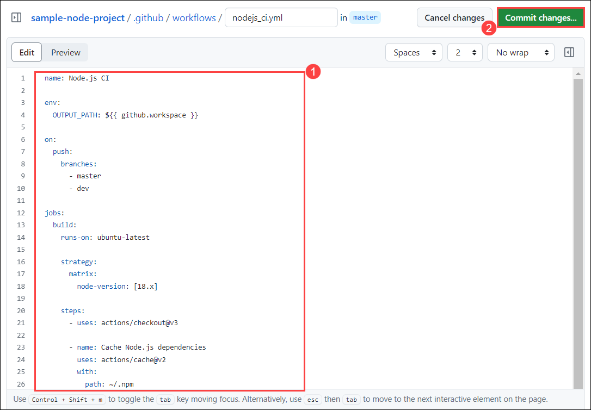

4. In the pop up windows of **Commit Changes** click on the **Commit changes**.

    

5. Click on **Action** **(1)**, verify the workflow has been executed successfully once the workflow is succedded select the newly created workflow **Create nodejs_ci.yml** **(2)**.

    

    > Feel free to go through the workflow

### Task 4: Code scanning and vulnerability detection

1. Navigate back to `github-action` repo.

1. Click on **Security** **(1)**, and click on **Enable vulnerability reporting** **(2)** next to the Private vulnerability reporting

    

1. Once navigated to **Code security and analysis**, click on the **Enable** button for Private vulnerability reporting, Dependabot alerts, Dependabot security updates, and Dependabot on Actions runners.

    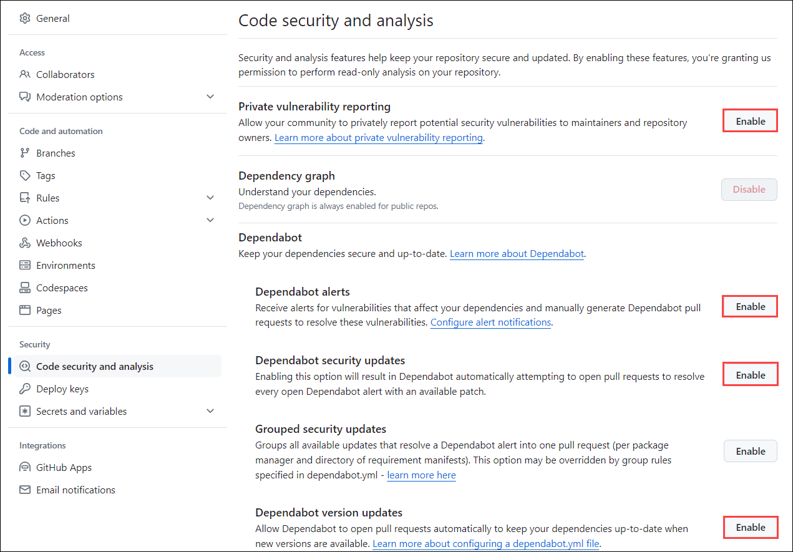

1. Click on **Set up** **(1)** button to enable CodeQL analysis and select the **Advanced** **(2)** option for creating a CodeQL Analysis YAML file.

         

1. Update the workflow name to **codeql-analysis.yml** ***(1)*** and review the yaml file. Select **Commit changes** ***(2)***, then select **Commit directly to the main branch** ***(3)*** and click on **Commit new file** ***(4)***.
  
   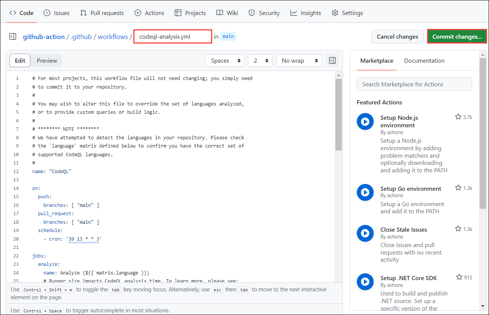

    
  
1. Navigate to **Actions** ***(1)*** tab, You can review the **workflow** ***(2)*** run.
    
    
  
1. Navigate to **Security** ***(1)*** tab and click on **View alerts** ***(2)***.
   
   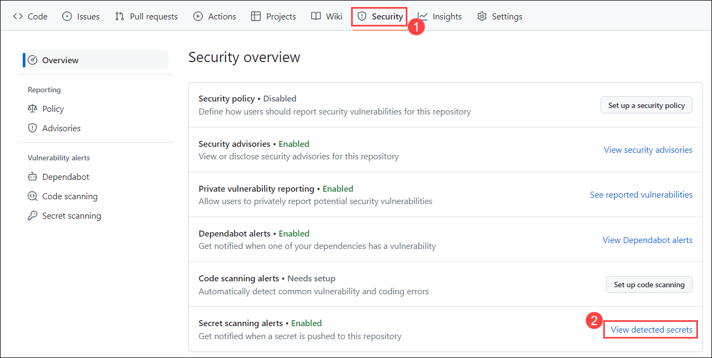
  
1. You will be navigated to the **Code scanning** section. You'll be able to visualize the **No code scanning alerts here!**.
   
1. Go to **Settings** -> **Code security and analysis** -> scroll down to **Push protection** and click **Enable**.

   

   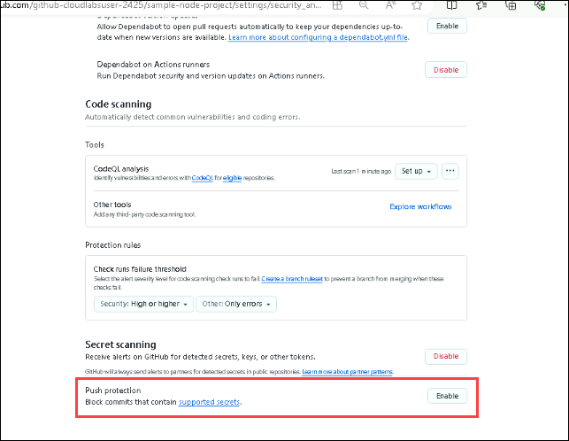

1. Once again, go to your profile, which is at the top of your right hand, and then select **Settings**.

   

1. Go to **Developer settings** -> **Personal access tokens** -> **Tokens (classic)(1)**, and then click on **Generate new token (2)** at the top. Now select **Generate new token (classic) (3)**.

    

1. From here, give your secret a name, **secret2**, set the **Expiration** to **_"Custom..."_** and select the next calendar day. By default, no permissions are granted, so it is safe to scroll to the bottom and click on **Generate token**.

   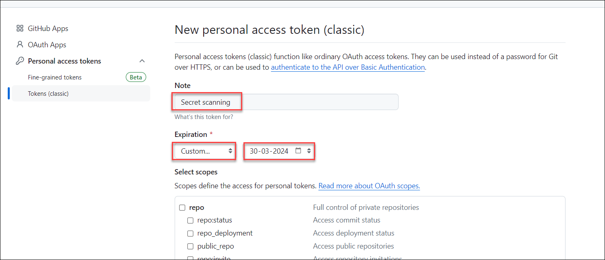

1. Once you've generated the token, click on the **"Copy"** icon to the right of the secret value in the notepad.

   

1. Navigate to **Code** **(1)** from the top navigation pane, click on **code** **(2)** drop-down, click on **local** **(3)**, and copy the **Repo URL** **(4)** in the notepad.

   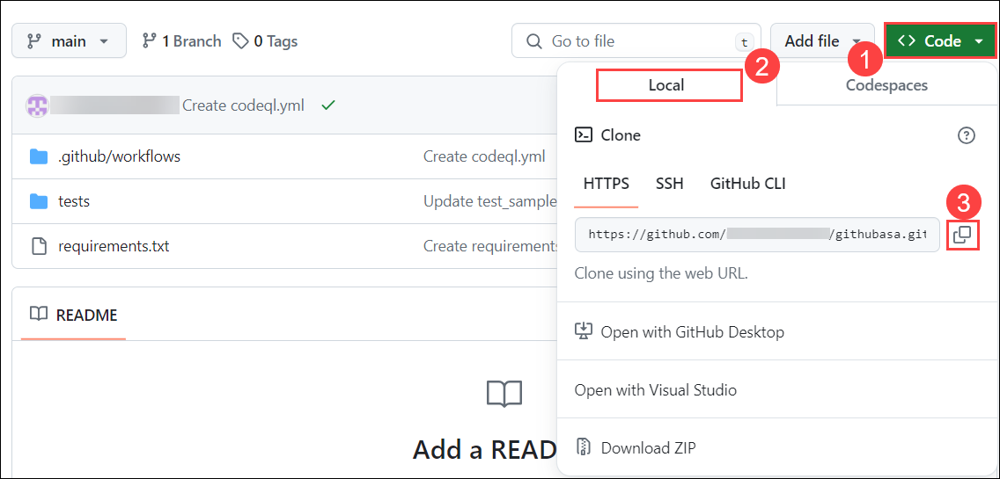

1. From the repo URL select the username as shown in the image below.

   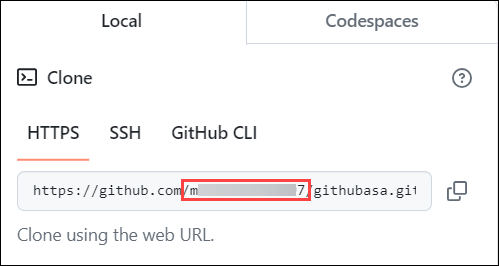

1. Click on **Add file** **(1)**  and click on **+ Create new file** **(2)**.

   

1. Provider file name as **ExampleScript.ps1** **(1)**, in the editor **copy and paste** **(2)** the below script, replace **YOUR_GITHUB_PAT** **(3)** with PAT you coped, **YOUR_GITHUB_USERNAME** **(4)** with GitHub username and **YOUR_GITHUB_REPO** **(4)**, and click on **commit changes** **(5)**.

   ```
   # Set the GitHub PAT
   $token = "YOUR_GITHUB_PAT"
   
   # Set the repository details
   $owner = "YOUR_GITHUB_USERNAME"
   $repo = "YOUR_GITHUB_REPO"
   
   # Set the file path and content
   $file = "path/to/file.txt"
   $content = "Hello, world!"
   
   # Create a new file in the repository
   $base64Content = [System.Convert]::ToBase64String([System.Text.Encoding]::UTF8.GetBytes($content))
   $body = @{
       message = "Create new file"
       content = $base64Content
   } | ConvertTo-Json
   
   $uri = "https://api.github.com/repos/$owner/$repo/contents/$file"
   $headers = @{
       Authorization = "Bearer $token"
       Accept = "application/vnd.github.v3+json"
   }
   
   $response = Invoke-RestMethod -Uri $uri -Method Put -Headers $headers -Body $body
   
   if ($response.content.sha) {
       Write-Host "File created successfully."
   } else {
       Write-Host "Failed to create file."
   }
   ```

   

1. In the **Commit** changes pop-up, click on **Commit changes** button.

   

1. A pop-up will come with a warning, **Secret scanning found a GitHub Personal Access Token secret on line 2.**, select **It's used in tests** **(1)** option and click on **Allow Secreat** **(2)**.

   

1. **Secret allowed. You can now commit these changes**. Editor window click on **Commit changes**.

1. In the **Commit** changes pop-up, click on **Commit changes** button.

   

### Summary

In this, you learn how to securely store sensitive data such as API keys and passwords within a GitHub repository using secrets, ensuring that this data remains protected and separate from the codebase. The code details the process for creating and managing these secrets and how to reference them in workflows to maintain security. Matrix builds enhance workflows by allowing the same workflow to run across multiple configurations, such as different language versions or operating systems. The code demonstrates defining a configuration matrix to run jobs in parallel, which boosts testing efficiency and ensures compatibility across various environments. This comprehensive approach to handling secrets, matrix builds, and artifacts ensure robust security, efficient testing, and effective data management in GitHub workflows.
