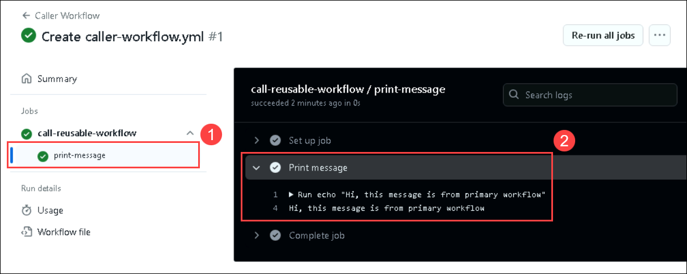
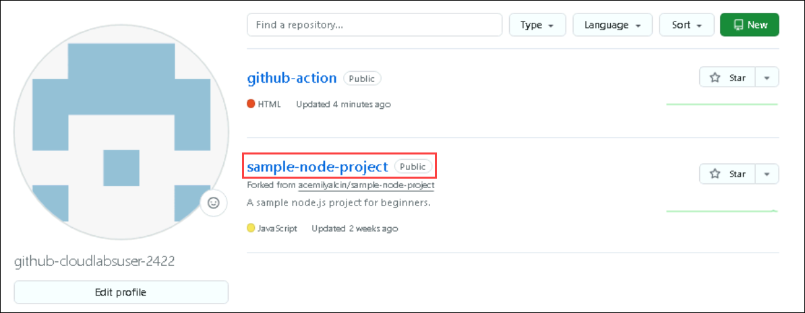
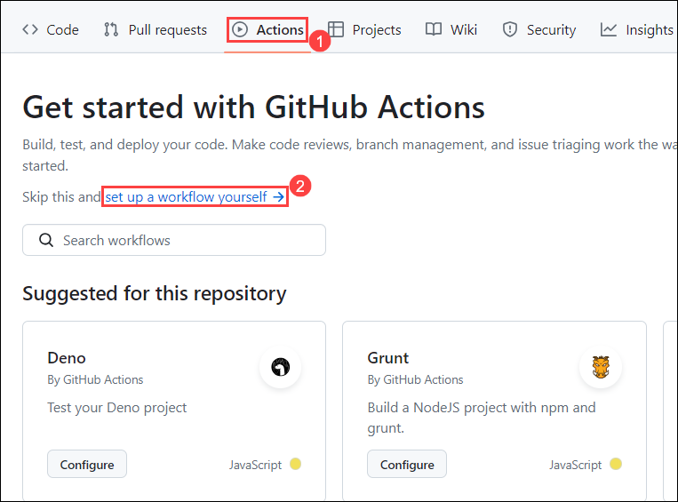
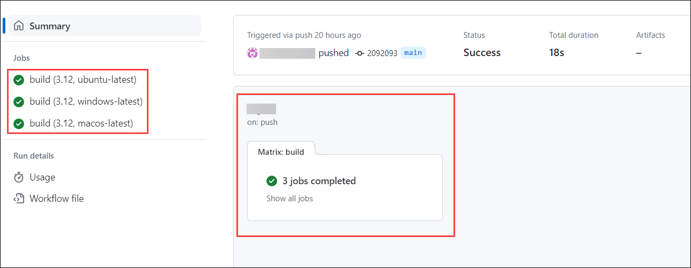
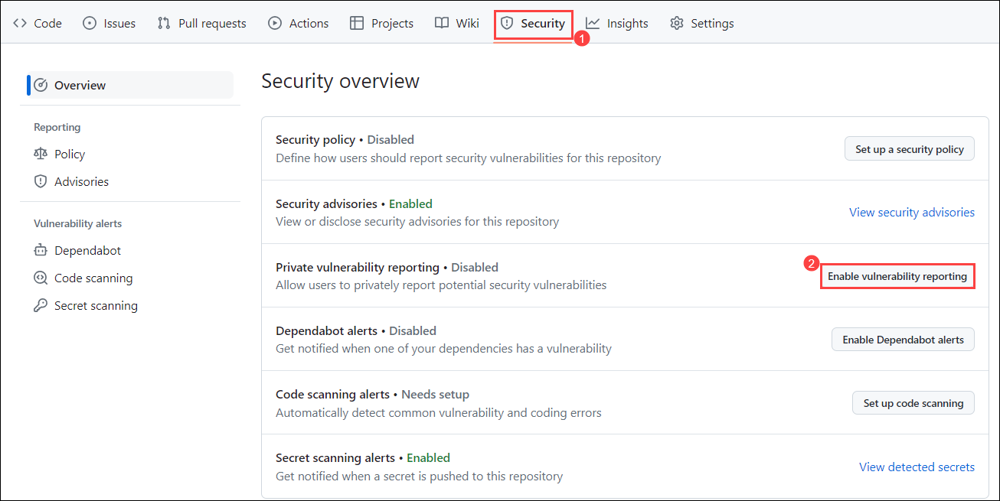
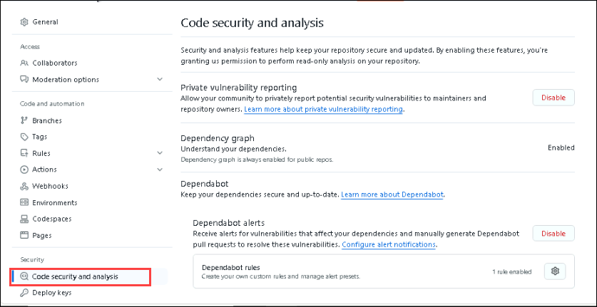
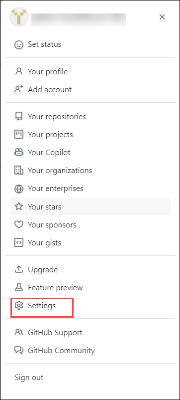
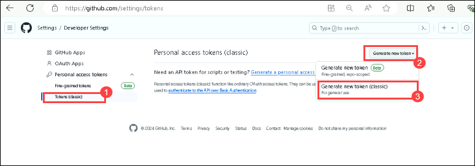
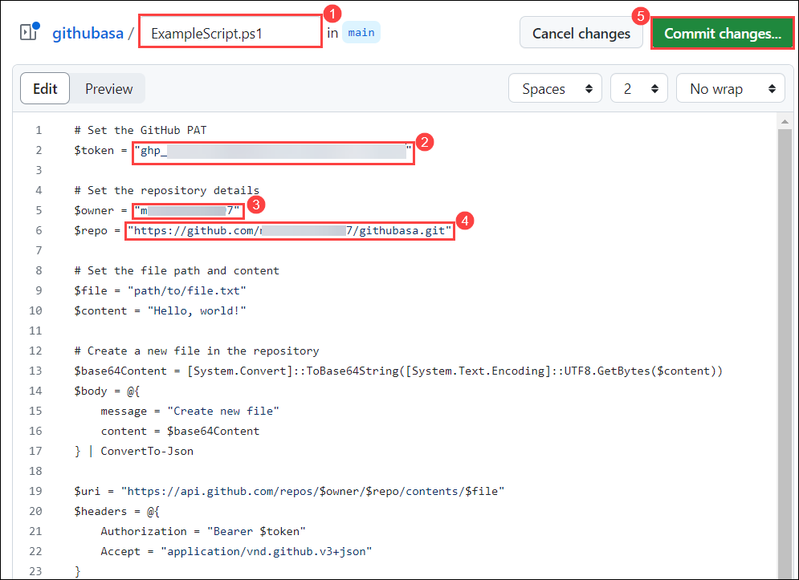
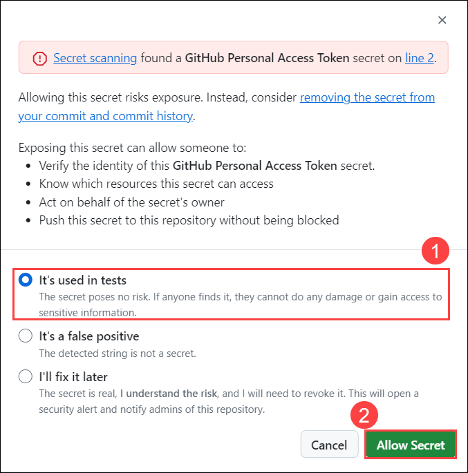

# Lab 3: Advanced Workflows

In this lab, you'll learn about reusable workflows and matrix builds.

## Task 1: Using Reusable Workflow

Rather than copying and pasting from one workflow to another, you can make workflows reusable. You and anyone with access to the reusable workflow can then call the reusable workflow from another workflow. Reusing workflows avoids duplication. This makes workflows easier to maintain and allows you to create new workflows more quickly by building on the work of others, just as you do with actions. Workflow reuse also promotes best practices by helping you use workflows that are well-designed, have already been tested, and have been proven to be effective. Your organization can build up a library of reusable workflows that can be centrally maintained. For more information, please go through the given link on [reusing workflows](https://docs.github.com/en/actions/using-workflows/reusing-workflows).

1. From GitHub, navigate to the **.github/workflows** folder, click on **Add files** **(1)**, and select the **+ Create new file** **(2)** option.

    

1. Copy the code given below, paste it in the window, and name the file **reusable-print-message.yml**.

   ```
   # This GitHub Actions workflow template is designed as a reusable component for printing a message.
   # It is triggered when called by another workflow using 'workflow_call', expecting a required input 'message' of type string.
   name: Reusable Print Message

   on:
     # Triggered when this workflow is called by another workflow
     workflow_call:
       inputs:
         # Defines a required input parameter 'message' of type string
         message:
           required: true
           type: string

   jobs:
     # Job named 'print-message' runs on an Ubuntu environment
     print-message:
       runs-on: ubuntu-latest

       steps:
         # Step to print the received message to the workflow log
         - name: Print message
           run: echo "Hi, this message is from primary workflow"
   ```

   .png)

1. In the **Commit changes (1)** pop-up window, click on the **Commit changes (2)** option.

   

   > **Note:** This GitHub Actions workflow template, named "Reusable Print Message," is designed to be a reusable component triggered by another workflow using **workflow_call**. It requires a string input parameter **message**. The workflow runs a job called **print-message** on an Ubuntu environment, which includes a step to print the received message to the workflow log.

1. Again, navigate to `.github/workflows`, Click on the **Add file (1)** dropdown and select **+ Create new file (2)**.

   

1. Copy the code given below, paste it into the window, and name the file **caller-workflows.yml**.

   ```
   name: Caller Workflow

   on:
     push:
       branches:
         - main
       paths:
         - '.github/workflows/caller-workflows.yml'
     workflow_dispatch:

   jobs:
     # Job to call the reusable workflow
     call-reusable-workflow:
       # Specifies the path to the reusable workflow
       uses: ./.github/workflows/reusable-print-message.yml
       with:
         # Passes the message to the reusable workflow
         message: "Hello from the caller workflow!"
    ```

   .png)   

1. On the **Commit changes (1)** pop-up window, click on the **Commit changes (2)** option.

   

1. Now, navigate to the **Actions (1)** tab and select **Create caller-workflow.yml (2)**. 

   

1. Select the **print-message (1)** job from the side-blade and **expand (2)** the same job in the output window. You'll see that the message from `reusable-print-message.yml` is fetched by the caller workflow. This is how the concept of reusable workflows in GitHub Actions works.

   

   > **Note:** This GitHub Actions workflow named "Caller Workflow" triggers on pushes to the main branch and manual dispatch for changes to the **.github/workflows/caller-workflows.yml** file. It calls a reusable workflow defined in **reusable-print-message.yml**, passing the message "Hello from the caller workflow!".

### Task 2: Explanation and Usage of Matrix Builds

Matrix builds and parallelism are advanced features in GitHub Actions that allow you to run multiple jobs concurrently.

Matrix builds let you test your code across multiple environments by creating a job matrix. This is a set of keys and values that create a combination of conditions and run a job for each one.

Parallelism allows you to run jobs or steps concurrently, reducing the total execution time.

In this task, you'll fork a public repository and create a GitHub action using Matrix build.

1. Navigate to the [sample-node-project](https://github.com/acemilyalcin/sample-node-project) repo and click on **Fork** **(2)**.

   .png)

   >**Note**: If a fork already exists, follow the below steps to delete the repository.

   - In the upper-right corner, navigate to the user menu and select **Your repositories** **(1)**.
   
     

   - Select ```sample-node-project``` **(1)** from the list and open it **(2)**.
    
     

   - Click on the **Settings** tab from the GitHub homepage.

     

   - In the **Settings** page, scroll to the bottom and select **Delete this repository**.

     

   - Accept all the warning prompts. In the delete `{github-username}/sample-node-project` pop-up, copy the **repository name** **(1)** and paste it in the **box** **(2)** to confirm your decision. Finally, click on the I understand the consequences, **Delete this repository** **(3)** option.

     

   - Navigate back to **step 1** and try to fork the repository again. 

1. On the **Create a new fork** page, click on the **Create fork** option.

   .png)

1. Navigate to the **Actions** **(1)** directory in your repository. in `Get started with GitHub Actions`, click on the **Set up a workflow yourself (2)** option.

   

1. Include the file name as **nodejs_ci.yml** **(1)**. In the editor, **copy and paste** **(2)** the below script, and click on the **Commit changes** **(3)** option.

    

    ```
    name: Node.js CI

    env:
      OUTPUT_PATH: ${{ github.workspace }}

    on:
      push:
        branches:
          - master
        paths:
          - '.github/workflows/nodejs_ci.yml'

    jobs:
      build:
        runs-on: ubuntu-latest

        strategy:
          matrix:
            node-version: [18.x]

        steps:
          # Step to checkout the repository
          - uses: actions/checkout@v3

          # Step to cache Node.js dependencies
          - name: Cache Node.js dependencies
            uses: actions/cache@v2
            with:
              path: ~/.npm
              key: ${{ runner.os }}-node-${{ matrix.node-version }}-${{ hashFiles('${{ env.OUTPUT_PATH }}/package-lock.json') }}
              restore-keys: |
                ${{ runner.os }}-node-${{ matrix.node-version }}-

          # Step to set up the specified version of Node.js
          - name: Use Node.js ${{ matrix.node-version }}
            uses: actions/setup-node@v3
            with:
              node-version: ${{ matrix. Node-version }}
    ```

    .png)

1. In the **Commit changes** pop-up window, click on the **Commit changes** option.

    

1. Click on the **Actions** **(1)** tab. Verify the workflow has been executed successfully by looking for the green badge. Select the newly created workflow, **nodejs_ci.yml** **(2)**.

    

    > **Note:** This GitHub Actions workflow, named "Node.js CI," is triggered by pushes to the main branch affecting the **.github/workflows/nodejs_ci.yml** file. It sets up a job that runs on an Ubuntu environment and utilizes a matrix strategy to specify Node.js version 18.x. The workflow includes steps to check out the repository, cache Node.js dependencies to optimize workflow performance, and set up the specified Node.js version using the actions/setup-node action.

### Task 3: Matrix Builds for Testing Across Multiple Environments

A matrix build is a CI/CD pipeline strategy that allows you to run tests across a variety of environments simultaneously. Each environment can vary by operating system, programming language version, dependency versions, and other factors. The matrix build configuration defines combinations of these variables, creating a grid (or matrix) of different test scenarios.

- **Comprehensive Testing**: Ensures that your software works under different configurations, reducing the risk of environment-specific bugs.

- **Parallel Execution**: Tests can run in parallel, speeding up the testing process and providing faster feedback.

- **Consistency**: It helps maintain consistent behavior across different environments, which is crucial for cross-platform applications.

In this task, you'll set up a GitHub action using the Matrix strategy to run the build across multiple OS simultaneously.

1. Navigate back to the `github-action` repo from the GitHub repository.

2. Navigate to the **Code** **(1)** tab. Click on **Add File** **(2)** and select the **+ Create new file** **(3)** option.

    

3. Provide the file name as **requirements.txt (1)**. In the editor, **copy and paste** **(2)** the below script, and click on the **Commit changes** **(3)** option.

   ```
   pytest
   ```

   .png)
   
4. In the **Commit changes** pop-up window, click on the **Commit changes** option.

   .png)

5. Click on the **Add File** **(1)** button and select the **+ Create new file** **(2)** option.

   .png)

6. Provide the file name as **tests/test_sample.py** **(1)**. In the editor, **copy and paste** **(2)** the below script, and click on the **Commit changes** **(3)** option.

    ```
    def test_sample():
        print("Running test_sample")
        assert 1 + 1 == 2
        print("Completed test_sample successfully")
    ```

    .png)

7. In the **Commit changes** pop-up window, click on the **Commit changes** option.

   .png)

8. Navigate to the **Code** **(1)** tab and click on the **.github/workflows** **(2)** folder.

   

9. In the **.github/workflows** folder, click on **Add files** **(1)**, and click on **+ Create new file** **(2)**.

      

10. Provide the file name as **matrix.yml** **(1)**. In the editor, **copy and paste** **(2)** the following script, and click on the **commit changes** **(3)** option.

    ```
    name: CI

    on:
        push:
            branches:
                - main
            paths:
                - '.github/workflows/matrix.yml'
        pull_request:
            branches:
                - main
            paths:
                - '.github/workflows/matrix.yml'
      
    jobs:
        build-ubuntu:
            runs-on: ubuntu-latest
            strategy:
                matrix:
                    python-version: [3.12]
            steps:
                - name: Checkout repository
                  uses: actions/checkout@v2

                - name: Set up Python ${{ matrix.python-version }}
                  uses: actions/setup-python@v2
                  with:
                      python-version: ${{ matrix.python-version }}

                - name: Install dependencies
                  run: |
                      python -m pip install --upgrade pip
                      pip install -r requirements.txt

                - name: Run tests
                  run: |
                      pytest

        build-windows:
            runs-on: windows-latest
            strategy:
                matrix:
                    python-version: [3.12]
            steps:
                - name: Checkout repository
                  uses: actions/checkout@v2

                - name: Set up Python ${{ matrix.python-version }}
                  uses: actions/setup-python@v2
                  with:
                      python-version: ${{ matrix.python-version }}

                - name: Install dependencies
                  run: |
                      python -m pip install --upgrade pip
                      pip install -r requirements.txt
                      # Ensure the Python Scripts directory is in the PATH
                      $env:Path += ";$env:USERPROFILE\AppData\Local\Programs\Python\Python${{ matrix.python-version }}\Scripts"
                      pip install pytest

                - name: Run tests
                  run: |
                      pytest
                  shell: pwsh

        build-macos:
            runs-on: macos-latest
            strategy:
                matrix:
                    python-version: [3.12]
            steps:
                - name: Checkout repository
                  uses: actions/checkout@v2

                - name: Set up Python ${{ matrix.python-version }}
                  uses: actions/setup-python@v2
                  with:
                      python-version: ${{ matrix.python-version }}

                - name: Install dependencies
                  run: |
                      python -m pip install --upgrade pip
                      pip install -r requirements.txt

                - name: Run tests
                  run: |
                      pytest

    ```
    .png)

    > **Note**: This CI configuration uses GitHub Actions to run tests on multiple OSs (Ubuntu, Windows, and macOS) with Python 3.12. It triggers push and pull requests to the main branch, checks out the code, sets up Python, installs dependencies, and runs tests with pytest, ensuring cross-platform compatibility.

12. In the **Commit changes** pop-up window, click on the **Commit changes** option.

    .png)

13. Click on the **Actions** **(1)** tab. Verify that the **Create matrix.yml** workflow has been executed successfully.

14. Click on the **Create matrix.yml** action. This configuration allows you to ensure your project is tested on multiple operating systems using Python 3.12, ensuring broader compatibility and catching environment-specific issues early.

    

### Task 4: Using artifacts and dependencies in workflows

Optimizing workflow performance by caching dependencies can significantly improve the execution time of your workflows. By caching dependencies, you can avoid unnecessary downloads and installations, resulting in faster and more efficient workflows.

- **Identify Dependencies**: Determine which dependencies in your project take a long time to install.
- **Add Cache Step**: In your GitHub Actions workflow file, add a step that uses the `actions/cache@v3` action.
- **Configure Cache Key**: Set the `key` to an expression that uniquely identifies each set of dependencies. This typically includes the package manager's lock file.
- **Specify Path**: Set the `path` to the directory where dependencies are installed.
- **Restore Cache**: If a cache hit occurs, the action restores the cached dependencies.

1. Navigate back to the `sample-node-project` repo from the GitHub repository.

1. Navigate to the **Code** **(1)** tab and click on the **.github/workflows** **(2)** folder.

    

2. In the **.github/workflows** folder, select **nodejs_ci.yml** **(1)** and click on **edit** **(2)**.

    

3. Replace the following code with the below code.

    ```
    name: Node.js CI

    env:
        OUTPUT_PATH: ${{ github.workspace }}

    on:
        push:
            branches:
                - master
            paths:
                - '.github/workflows/nodejs_ci.yml'

    jobs:
        build:
            runs-on: ubuntu-latest

            steps:
                - uses: actions/checkout@v3

                - name: Cache Node.js dependencies
                  uses: actions/cache@v2
                  with:
                      path: ~/.npm
                      key: ${{ runner.os }}-node-${{ hashFiles('${{ env.OUTPUT_PATH }}/package-lock.json') }}
                      restore-keys: |
                          ${{ runner.os }}-node-

                - name: Use Node.js
                  uses: actions/setup-node@v3
                  with:
                      node-version: 18.x
    ```
    
    .png)

4. In the **Commit changes** pop-up window, click on the **Commit changes** option.

    

5. Click on the **Actions** **(1)** button. Verify the workflow has been executed successfully by spotting the green badge. Select the newly created workflow **Update nodejs_ci.yml** **(2)**.

    

### Task 5: Code scanning and vulnerability detection

1. Navigate back to the `github-action` repo from the GitHub repository.

1. Click on the **Security** **(1)** option, and select **Enable vulnerability reporting** **(2)** next to the **Private vulnerability reporting** option.

    

1. Once you've navigated to the **Code security and analysis** option, click on the **Enable** button for Private vulnerability reporting, Dependabot alerts, Dependabot security updates, and Dependabot on Actions runners.

    

1. Click on the **Set up** **(1)** button to enable CodeQL analysis, and select the **Advanced** **(2)** option for creating a **CodeQL Analysis YAML file**.

         

1. Update the workflow name to **codeql-analysis.yml** **(1)** and review the YAML file. Select **Commit changes** **(2)**.
   

1. In the Commit Changes pop-up window, click on the **Commit changes** button.
  
    
  
1. Navigate to the **Actions** **(1)** tab. You can review the **workflow** **(2)** run.
    
    
  
1. Navigate to the **Security (1)** tab and click on **View alerts (2)**.
   
   .png)
  
1. You'll be navigated to the **Code scanning** section. Here, you'll be able to visualize the **No code scanning alerts here!**.

   .png)
   
1. Go to **Settings** option. Click on the **Code security and analysis** button. Now, scroll down to **Push protection** and click on **Enable**.

   

   

   > **Note:** If the Push protection is already enabled, please skip this step.

1. Once again, go to your profile, which is at the top of your right hand, and then select **Settings**.

   

1. Go to **Developer settings** -> **Personal access tokens** -> **Tokens (classic) (1)**, and then click on **Generate new token (2)** option at the top. Now select **Generate new token (classic) (3)**.

    

1. From here, give your secret a name, such as **Secret scanning**, set the **Expiration** to **_"Custom..."_** and select the next calendar day. By default, no permissions are granted, so it is safe to scroll to the bottom and click on **Generate token**.

   

1. Once you've generated the token, click on the **"Copy"** icon to the right of the secret value in the notepad.

   

1. Search **Notepad (1)** using the search box, and select the same from the suggestions **(2)**.

   .png)

1. Paste the **PAT token** that you copied in step **number 14**.

   .png)

1. Navigate to the **Code** **(1)** option from the top navigation pane, click on the drop-down **(2)**, select **Local** **(3)**, and copy the **Repo URL** **(4)**.

   .png)

1. From the repo URL, select the username as shown in the image below and paste it in **Notepad**.

   

1. Click on the **Code (1)** tab. Select the **Add file** **(2)** option and click on the **+ Create new file** **(3)** button.

   

1. Insert the file name **ExampleScript.ps1** **(1)**. In the editor, **copy and paste** **(2)** the below script, replace **YOUR_GITHUB_PAT** **(3)** with the PAT you copied, **YOUR_GITHUB_USERNAME** **(4)** with a GitHub username, and **YOUR_GITHUB_REPO** **(4)**, and click on **Commit changes** **(5)**.

   ```
   # Set the GitHub PAT
   $token = "YOUR_GITHUB_PAT"
   
   # Set the repository details
   $owner = "YOUR_GITHUB_USERNAME"
   $repo = "YOUR_GITHUB_REPO"
   
   # Set the file path and content
   $file = "path/to/file.txt"
   $content = "Hello, world!"
   
   # Create a new file in the repository
   $base64Content = [System.Convert]::ToBase64String([System.Text.Encoding]::UTF8.GetBytes($content))
   $body = @{
       message = "Create new file"
       content = $base64Content
   } | ConvertTo-Json
   
   $uri = "https://api.github.com/repos/$owner/$repo/contents/$file"
   $headers = @{
       Authorization = "Bearer $token"
       Accept = "application/vnd.github.v3+json"
   }
   
   $response = Invoke-RestMethod -Uri $uri -Method Put -Headers $headers -Body $body
   
   if ($response.content.sha) {
       Write-Host "File created successfully."
   } else {
       Write-Host "Failed to create file."
   }
   ```

   

1. In the **Commit changes** pop-up window, click on the **Commit changes** button.

   

1. You will get to see the following warning message on the screen: **Secret scanning found a GitHub Personal Access Token secret on line 2.** Select the **It's used in tests** **(1)** option and click on **Allow Secreat** **(2)**.

   

1. **Secret allowed. You can now commit these changes**. In the editor window, click on **Commit changes**.

1. In the **Commit changes** pop-up window, click on the **Commit changes** button.

   

### Summary

In this lab, you learned about reusable workflows and matrix builds.
